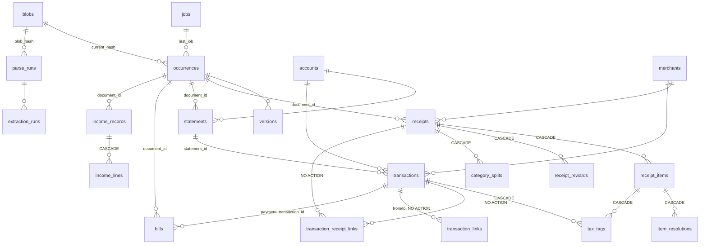

# SQLite audit — Home Manager library database

Audited 2026-09-30 on branch `reorganize-packages` (schema version 48, including the uncommitted `048_recurring_kind.sql`).

**How it was checked.** The project's CLAUDE.md forbids reading or copying the live libraries (`P:\Finances`,
`%LOCALAPPDATA%\HomeManager`), so no live data was read. All evidence comes from:
- the code;
- a scratch database built from migrations 001–048 in the session scratchpad;
- small experiments on copies of that scratch database;
- databases built by `tests/test_finance.py` and `tests/test_recurring_bills.py` (41 passed, 1 skipped).

Live-data checks are in a read-only script for you to run (see [Open questions](#5-open-questions), Q1).

## Status (2026-09-30)

| Finding | Status | Where |
|---|---|---|
| INT-1 | Done | Migration runner (`library/storage.py`) and tests in `tests/test_migrations.py` |
| INT-2, INT-9, SIM-1 (two columns), SIM-2 | Done | Migration `049_audit_cleanup.sql`; `library/trash.py` |
| INT-3, INT-4 | Done | `finance/ledger.py`; tests in `tests/test_reextraction.py` |
| INT-5, INT-6, INT-7, INT-8 | Done | Migration `050_strict_tables.sql` (all tables STRICT). INT-7 changed from "new tables only" to every table, at the owner's request. |
| INT-10 | Done | `finance/health.py` (`orphan_share`, `orphan_reference`) |
| SIM-1 (rest), SIM-3, READ-1 | Open | Not yet approved |

Not done:
- Only some of the INT-6 columns got CHECKs. The rest are free-form labels, logs, or tables nothing writes any more (`organization_runs`, `analysis_reviews`, `model_runs`, `events`, `match_method`, `issue_type`, `review_events.*_status`), and listing their values would add risk with no benefit.
- INT-5 got no separate `typeof()` CHECKs, because STRICT already refuses non-integers in `INTEGER` columns.

## 1. Summary

The database layer is in better shape than most apps at this stage:
- Foreign keys are on for every app connection.
- Money is stored as integer minor units, guarded by `typeof()` CHECKs.
- Enum-like columns on the ledger tables are mostly CHECKed.
- Migrations are transactional and version-checked, and the schema rebuilds cleanly from scratch.

The real risks are in **deletes**, not in types:
1. The migration runner deletes child rows without any error if a future migration rebuilds a parent table. This is proven below.
2. Two re-extraction paths delete ledger rows, and the delete takes the user's own tax tags and item identifications with it.
3. Emptying Trash leaves behind orphaned family-share rows, which then attach themselves to unrelated new records.

All of these are cheap to fix now. Converting to STRICT is not worth it at this stage (INT-7).

| Axis | Rating | Why |
|---|---|---|
| Integrity | **At Risk** | Schema constraints are strong, but three confirmed paths can lose or misattach user data without any error (INT-1, INT-2, INT-3), and a fourth makes re-extraction fail (INT-4). |
| Simplicity | Good | Plain SQL with a clear migration pattern. A few dead columns and one very large query string, but no over-engineering. |
| Readability | Good | Consistent snake_case, `_minor` and `_bp` units in names, comments in the DDL, and a per-migration table in `docs/schema.md`. Main oddity: `occurrences` is the documents table. |

## 2. Schema map

The scratch database has 87 tables, 120 foreign keys and 1 FTS5 table. No table is STRICT, and none uses AUTOINCREMENT. Every table has a primary key.
Surrogate keys are `INTEGER PRIMARY KEY` (rowid alias). Run and job tables use `TEXT` uuid keys.
You can reproduce the full DDL with the snippet in the [Appendix](#appendix--reproduce-the-schema-and-checks).

### Core: documents → ledger → reconciliation



**Typed-ID tables** use `(record_type, record_id)` and have no SQL foreign key: `financial_evidence_links`,
`reconciliation_issues`, `review_events`, `record_corrections`, `record_shares`, `family_assignments`.
Emptying Trash cleans them up by hand (`library/trash.py:133-141`).

### Tables by area

| Area | Tables | Notes |
|---|---|---|
| Capture | `jobs`, `blobs`, `occurrences`, `versions`, `events`, `capture_intents` | `occurrences` = one document at a path; `blobs` = content-addressed bytes |
| Library | `document_folders`, `folder_aliases`, `library_events`, `document_descriptions`, `managed_files`, `managed_organization_intents`, `managed_organization_events`, `trash_cleanup` | |
| Model work | `parse_runs`, `receipt_batches`, `receipt_batch_items`, `reasoning_runs`, `analysis_reviews`, `organization_runs`, `extraction_runs`, `model_identities`, `model_runs`, `assistant_runs`, `checkin_runs`, `item_resolution_runs`, `warranty_runs`, `tax_table_runs` | Status columns are mostly unchecked (INT-5) |
| Ledger | `merchants`, `accounts`, `statements`, `transactions`, `receipts`, `receipt_items`, `receipt_rewards`, `bills`, `income_records`, `income_lines`, `transaction_imports`, `financial_evidence_links`, `review_events`, `record_corrections` | Money columns are all `INTEGER … CHECK(typeof(x)='integer')` |
| Reconciliation | `transaction_receipt_links`, `transaction_links`, `reconciliation_issues`, `reconciliation_runs`, `recurring_obligations`, `payee_recurrence` | |
| Budgets & categories | `category_rules`, `budgets`, `category_splits`, `item_category_memory` | |
| Household | `products`, `item_aliases`, `item_resolutions`, `inventory_lots`, `lot_events`, `return_policies`, `warranties`, `web_search_cache` | |
| Assets & investments | `assets`, `investment_kinds`, `investment_accounts`, `holdings`, `investment_valuations`, `investment_events`, `investment_confirmations`, `investment_payment_rejections`, `tax_lots`, `tax_forms`, `tax_form_boxes` | |
| Jobs & taxes | `employers`, `job_filings`, `tax_tables`, `tax_figure_sets`, `tax_years`, `tax_units`, `businesses`, `tax_rules`, `tax_tags` | |
| Family | `record_shares`, `family_assignments` | |
| Search | `document_passages`, `document_passages_fts` (FTS5, external content, kept in sync by triggers), `document_index_state` | |
| Planning | `scenarios` | |
| Other | `backups` | |

### Checked and fine (no action needed)
- **Foreign keys on app connections.** `PRAGMA foreign_keys=ON` is set on every `Store.connection()` (`library/storage.py:221`), which every write goes through. The other raw connections are read-only, backup or copy connections: `family.py:28`, `ledger_check.py:22`, `backup.py:132,192,219`, `family_sync.py:182-237,408`. Migrating family copies with foreign keys off is actually the safer mode (see INT-1).
- **Concurrency.** WAL is set at open (`storage.py:174`); `timeout=15` gives a 15 s busy timeout; `synchronous=FULL`. That's right for one app process with worker threads.
- **Parameterized SQL.** All ~60 f-string SQL sites interpolate only table and column names from code constants (`RECORD_TABLES`, `CORRECTABLE`, `JOB_HISTORY`, `WORK_FILTERS`, dict keys built in code). Values always go through `?`. No injection path found.
- **Atomicity.** The 10 functions that write in more than one transaction (for example `extraction.py:1242`, `receipt_batch.py:24`) are deliberate queued → running → result status steps, and each ledger publish is one transaction (`ledger.py:288`).
- **Migrations.** Built from scratch: `user_version`=48, `integrity_check` ok, `foreign_key_check` empty. The three rebuilds so far (017 `reconciliation_runs`, 024 `lot_events`, 028 `recurring_obligations`) lost nothing, because no table has a foreign key to any of them.
- **Money** is integer minor units everywhere. The only `REAL` columns are model timing metrics in `model_runs`, which is fine.
- **INSERT OR REPLACE** is used only on tables with no child rows (`web_search_cache`, `analysis_reviews`, `record_shares`, `investment_valuations`), so REPLACE's hidden delete has nothing to cascade into.

## 3. Findings

### Integrity

#### INT-1 Migration runner deletes child rows when a migration rebuilds a table
- **Axis:** Integrity **Severity:** High. Nothing is wrong today, but this blocks every other constraint fix.
- **Evidence:** Migrations run on the Store's connection with `foreign_keys=ON` (`storage.py:173,221`), each wrapped as `executescript("BEGIN IMMEDIATE;" + script + "COMMIT;")` (`storage.py:100`). `PRAGMA foreign_keys` does nothing inside a transaction, so a script can't turn it off itself. Experiment: a textbook rebuild of `receipts` (create `receipts_new`, copy, `DROP TABLE receipts`, rename) run through the real `apply_migrations` **committed successfully and left `receipt_items` 1 → 0 and `receipt_rewards` 1 → 0**. `DROP TABLE` runs an implicit `DELETE`, which fires `ON DELETE CASCADE`. A parent with `NO ACTION` children would instead fail the upgrade. `docs/development.md` does not warn about this.
- **Why it matters:** Adding a CHECK, NOT NULL or STRICT to an existing table in SQLite requires exactly this rebuild. The first such migration on `receipts`, `income_records`, `transactions`, `inventory_lots`, `investment_accounts` or `holdings` would delete child rows on every user's library, and the pre-upgrade copy is pruned after two more upgrades.
- **Proposed fix:** follow SQLite's documented procedure in `apply_migrations`:
  ```python
  db.execute("PRAGMA foreign_keys=OFF")          # outside any transaction
  try:
      db.executescript("BEGIN IMMEDIATE;\n" + script.read_text())   # no COMMIT
      bad = db.execute("PRAGMA foreign_key_check").fetchall()
      if bad: raise sqlite3.IntegrityError(f"Upgrade step {number:03d} broke {len(bad)} references.")
      ... user_version check ...
      db.commit()
  finally:
      db.execute("PRAGMA foreign_keys=ON")
  ```
  Add a test to `tests/test_migrations.py` that runs a rebuild of `receipts` and asserts that child counts don't change. Add a line to `docs/development.md` describing the rebuild pattern.
- **Migration impact:** Code only; no schema change. Existing migrations are unaffected, since none rebuilds a parent table.
- **Effort:** S

#### INT-2 Emptying Trash leaves `record_shares` and `family_assignments` behind, and they attach to new records
- **Axis:** Integrity **Severity:** Critical
- **Evidence:** The typed-ID cleanup in `trash.py:136` covers `financial_evidence_links`, `review_events`, `record_corrections` and `reconciliation_issues`, but not `record_shares` or `family_assignments` (added later, in 035). Primary keys are rowid aliases without AUTOINCREMENT, so SQLite reuses the highest deleted id. Experiment: share receipt 1 (500 of 2000), delete it, insert a new receipt, and **the new receipt gets id 1 and inherits the share `(500, 2000)`**.
- **Why it matters:** `refresh_splits` (`ledger.py:367`) scales category splits by `record_shares`, and family routing reads `family_assignments`. A new, unrelated receipt would show only a quarter of its cost in budgets, or be treated as already delivered to a family member, with no warning.
- **Proposed fix:**
  1. Add `"record_shares"` and `"family_assignments"` to the dependent list at `trash.py:136`. Their `record_type` values (`receipt`, `bill`, `statement`, `income_record`) already match `RECORDS`.
  2. Add migration `049_orphan_cleanup.sql`:
     ```sql
     DELETE FROM record_shares WHERE (record_type='receipt' AND record_id NOT IN (SELECT id FROM receipts))
                                  OR (record_type='bill' AND record_id NOT IN (SELECT id FROM bills));
     DELETE FROM family_assignments WHERE
          (record_type='receipt' AND record_id NOT IN (SELECT id FROM receipts))
       OR (record_type='bill' AND record_id NOT IN (SELECT id FROM bills))
       OR (record_type='statement' AND record_id NOT IN (SELECT id FROM statements))
       OR (record_type='income_record' AND record_id NOT IN (SELECT id FROM income_records));
     PRAGMA user_version=49;
     ```
  3. Add a test in `tests/test_trash.py` that empties Trash on a shared receipt.
- **Migration impact:** Data cleanup only; no rebuild. Rows that have already been misattached can't be told apart from real ones: see Q2.
- **Effort:** S

#### INT-3 Re-extracting a receipt deletes the user's item identifications and item tax tags
- **Axis:** Integrity **Severity:** Critical
- **Evidence:** `publish_receipt` (`ledger.py:318-321`) runs `DELETE FROM receipt_items WHERE receipt_id=?` whenever the receipt is not user-decided (proposed, needs_review, or verified *automatically*: `_upsert`, `ledger.py:294`). `item_resolutions.receipt_item_id` and `tax_tags.receipt_item_id` are `ON DELETE CASCADE`. Experiment: a user-verified `item_resolutions` row and a user `tax_tags` row on an item of an auto-verified receipt, then the same DELETE: **both go 1 → 0**. Re-extraction is a normal action (`POST /api/documents/{id}/extraction-runs` with `force`, `api.py:627`). Item categories survive only through `item_category_memory`.
- **Why it matters:** A user tags a receipt line as a business expense. Later they re-run extraction on that receipt (for example after changing models), and the tag, and the deduction it fed into the tax estimate, disappears with no warning.
- **Proposed fix (needs Q3):** Either
  - (a) treat user work on the items as "user decided" and skip the rewrite (add `EXISTS` checks on `tax_tags.source='user'` or `item_resolutions.review_status='verified'` to `_upsert`'s keep rule); or
  - (b) update items in place by `position` and delete only positions that disappear.

  (b) keeps ids stable, and with them `inventory_lots`, which already key on `(receipt_id, position)`.
- **Migration impact:** Code only.
- **Effort:** M

#### INT-4 Re-extracting a statement fails if its lines are reconciled, and otherwise drops tax tags
- **Axis:** Integrity **Severity:** High
- **Evidence:** `publish_statement` (`ledger.py:440-447`) deletes "stale" extracted transactions, and the stale query excludes only rows with non-extraction evidence. Experiment:
  - A transaction with a `transaction_receipt_links` row (any status) makes the delete raise **`FOREIGN KEY constraint failed`**. The same happens with `transaction_links` or `bills.payment_transaction_id` (all `NO ACTION`). The whole publish rolls back and the run shows "Extraction failed; nothing was published." (`extraction.py:1304`).
  - Without links, a user `tax_tags` row on the transaction is removed by CASCADE, and a `reconciliation_issues` row is left orphaned. Only `financial_evidence_links` is cleaned up (`ledger.py:446`).
- **Why it matters:** Reconciliation runs after extraction, so most extracted statements have links. Re-extraction then fails every time with a message that hides the cause. Where it succeeds, user tax tags go missing.
- **Proposed fix (needs Q3):** Add to the stale query: `AND NOT EXISTS(SELECT 1 FROM transaction_receipt_links WHERE transaction_id=t.id AND review_status<>'rejected') AND NOT EXISTS(SELECT 1 FROM transaction_links WHERE t.id IN (from_transaction_id,to_transaction_id)) AND NOT EXISTS(SELECT 1 FROM bills WHERE payment_transaction_id=t.id) AND NOT EXISTS(SELECT 1 FROM tax_tags WHERE transaction_id=t.id AND source='user')`. For rows that are still deleted, also delete their `reconciliation_issues`, `review_events` and `record_corrections` rows, as Trash does.
- **Migration impact:** Code only.
- **Effort:** S

#### INT-5 Eight money columns accept text and floats
- **Axis:** Integrity **Severity:** Medium
- **Evidence:** These columns have no `typeof()` CHECK, unlike every other `_minor` column: `income_records.gross_pay_ytd_minor`, `income_records.net_pay_ytd_minor`, `investment_valuations.price_minor`, `investment_valuations.cost_basis_minor`, `investment_valuations.vested_minor`, `tax_tables.standard_deduction_minor`, `tax_tables.ss_wage_base_minor`, `tax_tables.additional_medicare_threshold_minor`. Experiment: inserting `'12.50'` into `gross_pay_ytd_minor` succeeds and stores **REAL 12.5**.
- **Why it matters:** One bad model value becomes a float that sums and compares wrongly, for example YTD pay feeding the Tax Zen W-4 advice.
- **Proposed fix:** After INT-1, rebuild these three tables with `CHECK (x IS NULL OR typeof(x)='integer')`. `income_records` has `income_lines` as a CASCADE child, so this must not run before INT-1.
- **Migration impact:** Table rebuild. It would fail on existing non-integer values: run the check script first (Q1). Cleanup is `UPDATE … SET x=CAST(round(x) AS INTEGER) WHERE typeof(x)='real'` after a review of the counts.
- **Effort:** M

#### INT-6 Status and enum columns without CHECK
- **Axis:** Integrity **Severity:** Medium
- **Evidence:** 34 enum-like columns have no CHECK. The ones that matter:
  - `parse_runs.status`: the partial unique index `parse_runs_active … WHERE status IN ('queued','running')` depends on exact values.
  - `jobs.status`, `extraction_runs.status`, `reasoning_runs.status`, `organization_runs.status`, `managed_organization_intents.status`: recovery, `managed_active_intent` and `WORK_FILTERS` (`storage.py:26`) match on literals.
  - `occurrences.source_status`, `occurrences.source_kind`.

  The rest are listed in the scratch analysis (`bills.bill_type`, `recurring_obligations.obligation_type`, `review_events.*_status`, `match_method`, `tax_rules.kind`, …).
- **Why it matters:** A typo such as `'runing'` would silently escape the active-run unique index, allowing duplicate concurrent readings, and would never be recovered by `recover()`.
- **Proposed fix:** Add CHECKs as each table is next rebuilt; don't rebuild just for this. Priority order if you want them now: `parse_runs`, `extraction_runs`, `jobs`, `occurrences`. The value sets come from the code constants. The check script lists the values present today.
- **Migration impact:** Rebuild per table, after INT-1. It fails if unexpected values exist, so check first (Q1).
- **Effort:** M

#### INT-7 No STRICT tables: recommend *not* converting
- **Axis:** Integrity **Severity:** Low
- **Evidence:** 0 of 87 tables are STRICT. The type risk that matters, money, is already covered by `typeof()` CHECKs, except for INT-5.
- **Recommendation:** Converting means rebuilding all 87 tables, which costs far more than it protects. Instead, write **new** tables as `STRICT` from 049 onward, and add a line to `docs/development.md`. Leave existing tables alone.
- **Effort:** S (doc rule only)

#### INT-8 Boolean columns without a 0/1 CHECK
- **Axis:** Integrity **Severity:** Low
- **Evidence:** `accounts.active` and `receipt_batch_items.reused`. Experiment: `active='yes'` is accepted. All other booleans are checked `IN (0,1)`.
- **Proposed fix:** Fold into the next rebuild of those tables. Not worth a rebuild on its own.
- **Effort:** S

#### INT-9 Two timestamp formats in one column family
- **Axis:** Integrity **Severity:** Low
- **Evidence:** `now()` writes `2026-09-30T12:00:00.123456+00:00` (`storage.py:148`). Migration 024 seeded 7 `return_policies` rows with `datetime('now')` = `2026-09-30 12:00:00` (`024_returns_assets.sql:40-46`). The check script flagged all 7 on the scratch and test databases. `' ' < 'T'`, so the two formats don't sort or compare correctly.
- **Proposed fix:** Include in 049: `UPDATE return_policies SET created_at=replace(created_at,' ','T')||'+00:00', updated_at=replace(updated_at,' ','T')||'+00:00' WHERE created_at NOT LIKE '%T%';`
- **Migration impact:** Data only.
- **Effort:** S

#### INT-10 The ledger health check doesn't look for typed-ID orphans
- **Axis:** Integrity **Severity:** Low
- **Evidence:** `finance/health.py` checks splits and currency, but nothing checks that `(record_type, record_id)` rows point at something. `reconciliation_issues.record_type` and `review_events.record_type` have no CHECK. INT-2 and INT-4 show that orphans do occur.
- **Proposed fix:** Add the orphan query from `db_checks.py` to the health check, so it shows up in the existing `ledger health` CLI and in the app log.
- **Effort:** S

### Simplicity

#### SIM-1 Dead columns
- **Axis:** Simplicity **Severity:** Low
- **Evidence:** Grep of `src/**/*.py` finds these columns are never read or written:
  - `bills.bill_type` (always its default `'other'`)
  - `investment_valuations.vested_minor`
  - `investment_events.reverses_event_id`

  And these are written but never read:
  - `jobs.year` and `jobs.month` (always NULL, `storage.py:241`)
  - `occurrences.folder_year` and `occurrences.folder_month` (always 0 since Inbox-only capture, `storage.py:263`), which also make up two-thirds of index `occurrences_root`.
- **Proposed fix:** `ALTER TABLE bills DROP COLUMN bill_type; ALTER TABLE investment_valuations DROP COLUMN vested_minor;` (no rebuild; SQLite ≥ 3.35). Leave the others for now: `reverses_event_id` has a foreign key and `folder_*` is indexed, so dropping them needs a rebuild. Remove them when those tables are next rebuilt.
- **Effort:** S

#### SIM-2 Missing indexes on the library page's per-row lookups
- **Axis:** Simplicity/performance **Severity:** Low
- **Evidence:** In `EXPLAIN QUERY PLAN` on the scratch database, `library_query()` (`storage.py:407`) runs full `SCAN`s of `transaction_receipt_links` (by `receipt_id`) and `managed_organization_intents` (by `document_id`) **for every document row**. These also fully scan: `reconciliation_issues` by `(record_type, record_id)` (the UNIQUE index starts with `issue_type`), `transactions` by `statement_id`, `extraction_runs` by `document_id`, and `review_events` by record.
- **Proposed fix:** Add in 049:
  ```sql
  CREATE INDEX transaction_receipt_links_receipt ON transaction_receipt_links(receipt_id);
  CREATE INDEX managed_intents_document ON managed_organization_intents(document_id, blob_hash, created_at);
  CREATE INDEX reconciliation_issues_record ON reconciliation_issues(record_type, record_id);
  CREATE INDEX transactions_statement ON transactions(statement_id);
  CREATE INDEX extraction_runs_document ON extraction_runs(document_id, created_at);
  ```
  At household scale this is cheap insurance, not urgent. Leave the other ~65 unindexed foreign-key columns alone; they matter only on parent deletes.
- **Effort:** S

#### SIM-3 `library_query()` is one 70-line string with ~30 correlated subqueries
- **Axis:** Simplicity/Readability **Severity:** Low
- **Evidence:** `storage.py:407-479`. `…WHERE blob_hash=o.current_hash` against the four record tables is repeated 5 times, once each for amount, currency, status, date and merchant.
- **Recommendation:** Leave it. It's well commented and works, and turning it into a SQL VIEW would tie every future rebuild of those tables to recreating the view. Revisit only if the library page gets slow with real data.

### Readability

#### READ-1 `occurrences` is "documents"; `hash`, `blob_hash` and `current_hash` all name the same thing
- **Axis:** Readability **Severity:** Low
- **Evidence:** Every foreign key named `document_id` points at `occurrences(id)` (for example `receipts.document_id`). The content hash is `blobs.hash`, `versions.hash`, `occurrences.current_hash` and `*.blob_hash`. `docs/schema.md:13` explains `occurrences` once.
- **Recommendation:** Don't rename: that means rebuilding 20+ tables and touching ~700 queries. Instead, add one sentence at the top of `docs/schema.md`: "`occurrences` is the documents table; `document_id` always means `occurrences.id`; `hash`, `blob_hash` and `current_hash` are all a `blobs.hash`."
- **Effort:** S

Everything else I checked for readability is fine: consistent snake_case, plural table names, unit suffixes (`_minor`, `_bp`, `_ms`, `_days`), DDL comments on non-obvious columns, and a per-migration table in `docs/schema.md`.

## 4. Recommended fix order

1. **INT-1** (runner). It must come first: every later rebuild depends on it.
2. **INT-2 + INT-9 + SIM-2 + SIM-1 drops** in one migration `049`: orphan cleanup, timestamp fix, indexes, two `DROP COLUMN`s. There are no rebuilds, and none of it can fail on existing data except the orphan deletes, which are what we want.
3. **INT-3, INT-4** (code only; after your answer to Q3).
4. **INT-10** (health check), so any remaining orphans surface.
5. Run `db_checks.py` on your live data (Q1). Use the result to decide whether **INT-5**, and then **INT-6**/**INT-8**, need cleanup before their rebuilds.
6. **INT-7**: the doc rule "new tables are STRICT", any time.

## 5. Open questions

- **Q1. Live-data checks.** Would you run the read-only checker `scripts/db_checks.py` yourself and paste the output, redacted as you like?
  - **What it does:** opens the file with `?mode=ro`, copies it into memory with SQLite's backup API, closes the file, and runs `integrity_check`, `foreign_key_check`, type drift on every INTEGER column, typed-ID orphans, values in unchecked enum columns, date and timestamp formats, and duplicates.
  - **What it prints:** only counts, row ids and app enum values; never names, amounts, text or paths.
  - **Command:** `python scripts/db_checks.py "<library>\inventory.sqlite3"`
- **Decided 2026-09-30.**
  - Q2: delete only orphans.
  - Q3: option (b) for both receipts and statements. Re-extraction refreshes the record and keeps the lines that still match: transactions match by fingerprint, receipt items by content (normalized description + line total + ordinal), not by position. User work on a line that no longer matches is never dropped without notice: those lines are kept, and the record goes to needs_review with a note.
  - Q4: still open.
- **Q2. Shares that may already be misattached (INT-2).** If you've emptied Trash on a shared receipt or bill since family sharing was built, a newer record may already carry its share. Should 049 only delete shares whose record is gone, or should I also list shares whose `created_at` is earlier than their record's `created_at`, so you can review them?
- **Q3. Re-extraction of a record the user has worked on (INT-3/INT-4).** When a receipt or statement was accepted automatically but you've since tagged, identified or reconciled its lines, should re-extraction:
  - (a) leave the record untouched, as it does for user-verified ones; or
  - (b) refresh the record but keep the lines you've worked on, matched by position for receipt items and by fingerprint for transactions?
- **Q4. STRICT for new tables (INT-7).** OK to make it the rule from 049 on?

## Appendix — reproduce the schema and checks

```python
# Build a scratch DB from migrations (no live data): run from the repo root.
import sqlite3, sys; sys.path.insert(0, "src")
from home_manager.library.storage import apply_migrations
db = sqlite3.connect("scratch.sqlite3", isolation_level=None); db.execute("PRAGMA foreign_keys=ON")
apply_migrations(db, 0)
print("\n".join(sql for (sql,) in db.execute("SELECT sql FROM sqlite_schema WHERE sql IS NOT NULL")))
```

The experiments behind INT-1 to INT-5 and INT-8 were small scripts run on copies of that scratch database: insert minimal rows, then run the statement the app runs and count the dependent rows.
