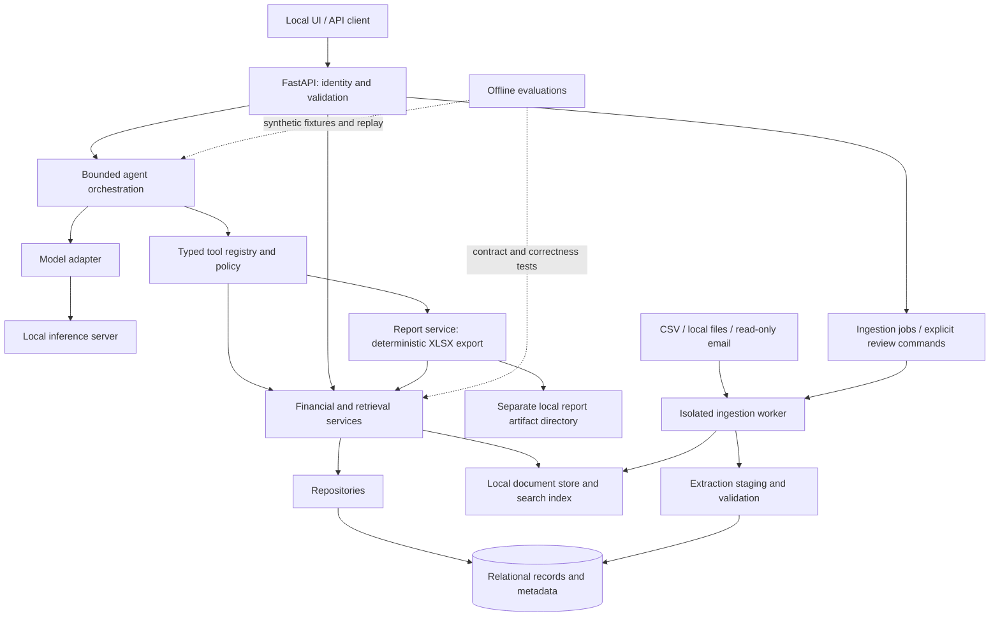

# AI Home Manager: proposed architecture

Decision update, 2026-09-24: image reading uses a local vision model strictly for text extraction. OCR execution and label-based field inference are removed. A separate reasoning model, to be selected by the user, will consume saved text for fields, titles and classification. Earlier OCR-first and judge-cascade proposals below are superseded by this separation. See [current extraction behavior](receipt-parsing.md).

Status: architecture proposal, updated 2026-09-22 with confirmed deployment and reporting requirements. The user subsequently authorized D1–D2 document capture implementation; those slices are now available. Later components remain proposed. See [manual testing](manual-testing.md).

Confirmed: Windows host with 16 GB VRAM and 32 GB RAM; inference on the same machine; one user with same-machine access; Gmail as the first email provider; multiple currencies required; downloaded CSV exports, Excel workbooks, and scanned images stored locally as source evidence; Excel financial report generation exposed as a typed tool. USD is the consolidated reporting currency, including conversion of validated foreign-currency receipt totals. Exchange-rate source selection is delegated to this design.

## Repository inspection

The repository contains a placeholder `readme.md`, a `.gitignore` excluding `.venv` and itself, and a local `.venv` directory. Git history contains one initial commit. There are no application modules, dependency manifests, tests, migrations, or repository/ancestor AGENTS.md instructions found in the inspected paths. The README already has an uncommitted user change; it is preserved. Virtual-environment contents were not audited.

Before implementing, extend ignore rules to cover secrets, databases, attachments, model artifacts, traces, and private evaluation data. Store runtime data outside the checkout. Do not assume ignore rules protect already tracked files.

## Recommended design and decisions

Build a modular Python monolith: FastAPI serves requests, a small bounded agent orchestrates typed tools, and deterministic domain services own financial rules. A separate local worker process performs ingestion using the same application package. A separately operated local model server exposes an OpenAI-compatible endpoint. Use LangChain for local document-model composition behind adapters; no microservices, agent swarm, or broker is needed initially.

| Decision | Proposed default | Reconsider when |
| --- | --- | --- |
| Deployment | Confirmed Windows, 16 GB VRAM / 32 GB RAM, single user, same-machine inference, loopback only | LAN access or separate inference host is required |
| Database | SQLite on local disk, foreign keys enabled, short transactions, migrations from day one | Multiple active users or sustained concurrent writers justify PostgreSQL |
| Persistence tooling | SQLAlchemy repositories and Alembic migrations | An implementation spike demonstrates unnecessary complexity |
| Agent | Explicit state machine with bounded sequential tool calls | Measured workflows need durable agent resumptions or parallel calls |
| Model protocol | Small Chat Completions function-calling subset behind an adapter | A required server lacks tested support |
| Documents | Immutable local originals, relational metadata, rebuildable full-text index | Measured lexical retrieval misses justify local embeddings |
| Ingestion scheduling | Durable database jobs and one worker; manual trigger first | Throughput measurements justify a queue service |
| Financial authority | Immutable downloaded originals are primary evidence; validated database records are the operational representation; Python computes results | Never delegate this authority to a model or generated workbook |
| UI | API first, then a minimal local review/search/chat UI | Household deployment changes identity requirements |
| Email | Gmail API, bounded read-only sync after V1 | User prioritizes Gmail ahead of the initial local-file release |
| Currencies | V1 USD consolidated reporting, with original currency/amount preserved; historical ECB reference rates downloaded locally | A currency/date outside ECB coverage requires an additional explicitly configured source |
| Excel reports | V1 typed tool creates a new local `.xlsx` artifact from deterministic results | Editing existing workbooks or external delivery is requested |
| Laya | V1 local document-assessment and routing evaluation; shadow mode before calibrated use | Held-out evidence supports skipping larger-model interpretation safely |
| LangChain | Local model composition and typed-output adapter layer for document assessment | Keep business rules, policy and durable jobs in application services |
| Vision interpretation | Separate local VLM capability spike for uncertain image extraction | Neither existing text-model candidate supplies image interpretation |

These defaults do not require selecting an inference runtime yet. Hardware, exact model revision, quantization, context length, and tool-call parser all affect deployment. Avoid treating active MoE parameter count as total memory requirement.

The hardware spike must measure total RAM/VRAM with Windows, the API, and inference running together. Start with one loaded primary model, bounded context and one inference request at a time; serialize extraction/model work rather than keeping a second classifier resident. Do not promise that either candidate fits fully in VRAM at useful context until tested. GPU vendor/model remains relevant to runtime selection but does not block application design. Keep the Python application native Windows initially; use WSL2 for inference only if the chosen runtime requires it. Private files belong in an ACL-protected local data directory outside Git and cloud-synchronized folders.

## System and trust boundaries



| Component | Owns | Must not do |
| --- | --- | --- |
| Agent | Request interpretation, selecting tools, bounded workflow state, grounded response composition | SQL, arbitrary Python/shell execution, filesystem access, credentials, financial arithmetic, authorization decisions |
| Tools | Pydantic request/result schemas, argument validation, policy enforcement, service dispatch, stable errors | Embed business rules in prompts or bypass services |
| Domain/services | Money/date semantics, calculations, matching rules, source coverage, validation | Depend on FastAPI, inference SDKs, or generated code |
| Report service | Snapshot selection, deterministic workbook rendering, artifact lifecycle and provenance | Modify source documents, accept model-calculated totals, or execute spreadsheet formulas |
| Repositories/database | Parameterized persistence, constraints, transactions, migrations, provenance | Treat chat history as financial records |
| Ingestion | Source cursors, immutable capture, parsing, staged extraction, deduplication, retries | Execute document content, grant permissions, silently promote model guesses |
| Model adapters | Protocol normalization, capability checks, timeouts, model configuration | Access source credentials or call tools themselves |
| Evaluation | Fixtures, expected outcomes, trace scoring, regression reports | Write production records or use an LLM judge as the sole oracle |
| API | Authentication, request limits, schema validation, run/job lifecycle, review commands | Reimplement calculations or accept model assertions as authorization |

Domain code sits at the center; adapters and repositories implement interfaces it consumes. Agent and API both use services, so deterministic functions remain usable when inference is unavailable. Pydantic defines external contracts; database models remain separate.

The agent's financial/source access is read-only, with one explicitly scoped local artifact-creation capability for Excel reports. In SQLite this is not a complete security boundary: use a read-only connection for query repositories, separate writer paths for ingestion/review and report metadata, and filesystem/process restrictions where feasible. PostgreSQL should use distinct least-privilege roles. The application writes run/audit metadata; the agent cannot arbitrarily mutate records or files.

## Financial records and arithmetic

Initial entities: accounts, transactions, categories, category assignments, balance snapshots, import batches, source records, documents, document versions/text segments, extraction candidates, receipt-match candidates, ingestion jobs, and minimal run/tool events. Defer specialized bill, subscription, warranty, and contract tables until their workflows are specified; generic document types and extracted fields can preserve evidence meanwhile.

Every authoritative record needs provenance: source identifier, import batch, original record reference/hash, import time, effective date, and validation state. Corrections preserve the original and record a revision or superseding relationship. A document hash deduplicates bytes; source-occurrence records preserve where each copy came from.

Downloaded originals are the source-of-truth evidence, not mutable working files. Copy them into managed immutable storage and retain their original filename, hash, source, and receipt/download time. Link each extracted field to its row, cell, or page when possible. The database holds validated normalized facts for queries; disagreements with a source trigger review and versioned correction. Model extraction is a proposal, not proof. Preserve user corrections and validation decisions alongside provenance so database reconstruction does not discard them. Generated Excel reports are derived outputs, never automatically re-ingested as new financial evidence. Conflicting source versions remain visible until resolved.

Use integer minor units plus an explicit currency and currency exponent for posted money. Use Python Decimal for intermediate ratios/rates, an explicit rounding policy, and exact string serialization where Decimal is exposed. Never use binary floats for monetary calculations. SQLite must not silently coerce money into approximate numeric storage. Unknown currencies or precision fail validation.

Default semantics to lock down with fixtures:

- Normalize signs explicitly per importer: positive inflow, negative outflow. Preserve original signs and fields. Credit-card balances need an explicit liability convention.
- Spending uses posted transactions, excludes matched internal transfers, and reports refunds consistently as reductions. Pending entries remain visible but are excluded by default. Uncertain transfer/category assignments are disclosed.
- Date queries use explicit half-open intervals `[start, end)` and a household timezone. Preserve date-only transaction dates without inventing timestamps. Specify posted date versus transaction date in results.
- Report consolidated USD totals using the conversion policy below, alongside original-currency detail. Never sum unlike original currencies directly.
- Preserve original purchase currency/amount and account settlement currency/amount separately when a source supplies both. Spending by account uses the settled amount; do not double-count the original purchase as another posting. Currency exponents must support currencies with zero or three fractional digits as well as two. Never infer currency solely from an ambiguous symbol.
- Report balances from source snapshots with `as_of` and source labels. Derive a balance only with an opening balance and known complete transaction coverage; never claim an incomplete import is the current bank balance.
- Period comparisons return both totals, exact delta, coverage, and a documented percentage formula. Zero baseline produces an undefined percentage, not infinity or an invented number. Negative baselines need an explicit policy before percentage reporting.
- Import identity prefers stable provider/account transaction IDs. Heuristic fingerprints flag possible duplicates without dropping legitimate equal-value transactions. Re-importing the identical batch must be idempotent.

This is initially a household reporting system, not a full accounting ledger. USD reporting conversion is in scope; double-entry bookkeeping, reconciliation automation, tax calculations, investment valuation, and realized/unrealized FX gain accounting remain outside V1.

## Typed tools and grounded answers

All tools have versioned names, strict Pydantic arguments (unknown fields rejected), bounded result sizes, documented units, stable identifiers, and typed errors. Authorization context is injected by the application, never supplied by the model. Database identifiers and paths are not interchangeable.

| Tool | Essential inputs | Essential output |
| --- | --- | --- |
| `search_transactions` | Account/category filters, explicit dates, status, cursor, limit | Transaction records, source refs, pagination, coverage |
| `get_balances` | Account IDs, optional as-of time | Snapshot/derived values, currency, as-of, derivation and completeness |
| `calculate_spending` | Dates, accounts, categories, inclusion policy | USD reporting total, original-currency subtotals, applied FX policy/rate references, coverage and evidence |
| `compare_spending_periods` | Two explicit intervals and common filters | Totals, delta, defined/undefined percentages, comparable coverage |
| `search_documents` | Bounded text query, type/date filters, cursor | Ranked snippets with document and page/segment IDs |
| `get_document` | Opaque document ID, bounded page/segment selection | Text/metadata and source refs; bytes via an authorized API endpoint |
| `match_receipts_to_transactions` | Receipt ID and bounded candidate filters | Ranked candidates, rule features, ambiguity; no committed link |
| `search_email` | Bounded query/date/mailbox filters | Locally ingested message metadata/snippets and sync coverage |
| `get_email_attachments` | Message ID and attachment IDs | Ingested attachment handles and status, not arbitrary URLs or paths |
| `lookup_exchange_rate` | Source ISO currency, target currency fixed to USD in V1, valuation date | Immutable rate ID, exact Decimal-string rate, pair/direction, requested/effective dates, source evidence, retrieval time, cache status and policy version; typed error if unresolved |
| `convert_document_amount` | Document/extraction-candidate ID, amount-field ID, rate ID returned by lookup | Original amount/currency, deterministic USD amount, rate ID and rounding policy, validation state and evidence references |
| `create_financial_report` | Report kind, explicit periods, account/category/currency filters, approved grouping/template, idempotency key | Report ID, authorized local download handle, hash, snapshot/version, currency totals and coverage |

The email tools arrive with email ingestion. An uncached attachment is reported as unavailable; fetching belongs to the ingestion job pathway. Searches must distinguish an empty result from incomplete synchronization or a failure. Aggregate tools calculate over the complete validated query set, never the first page of search results.

Agent lifecycle: validate request/context; advertise only enabled tools; ask the model; validate returned tool names/arguments; enforce policy/budgets; execute; append bounded results; repeat or finalize. Initial proposed budgets: eight tool calls, one argument-repair attempt, a configurable wall-clock deadline, and a prompt/output token cap. Start sequentially. Retry transient reads within the remaining budget; do not retry authorization failures or loop indefinitely. Cancellation and model/tool outages return explicit partial/failed status, never success-shaped empty data.

The final response carries structured facts, evidence IDs, assumptions, freshness/coverage, and optional narrative. Render financial numbers directly from verified service results. Reject nonexistent evidence IDs and unsupported structured numerical claims. Citations alone do not prove narrative correctness: constrain financial answer templates in V1 and evaluate unsupported narrative claims separately. Unknown dates/accounts or ambiguous intent should lead to clarification, not fabricated defaults. Conversation context is temporary task context, not permanent financial memory.

## Excel reporting and currency conversion boundary

Include `create_financial_report` in V1. It calls financial services and renders their validated results into a new `.xlsx` workbook, using a library such as openpyxl behind a report-writer interface. Python calculates all values before export; Excel formulas are not the authoritative calculator. openpyxl itself does not evaluate formulas ([library documentation](https://openpyxl.readthedocs.io/en/3.1.3/simple_formulae.html)). No installed Excel instance or COM automation is required for this design.

Start with spending summary, period comparison, and transaction-detail templates. Include Summary, Transactions, Exchange Rates, and Provenance/Assumptions sheets: USD reporting totals, original amounts/currencies, per-row converted amounts, rate/date/source or actual-settlement basis, date/sign/inclusion policies, completeness warnings, record/source IDs and hashes, dataset revision, generation time, and template version. Render a coherent database and rate-set snapshot so concurrent ingestion cannot mix old and new data. Retain a report manifest sufficient to reproduce the numbers. Export all matching records up to a documented workbook/resource limit; fail clearly or split explicitly instead of silently truncating.

The model selects only typed filters and a template; it cannot supply arbitrary cell formulas, totals, filesystem paths, or workbook code. Treat imported descriptions and filenames as literal strings, including values beginning with `=`, `+`, `-`, or `@`. Disable external workbook links, macros, and active content. Preserve exact canonical monetary strings/minor units in the underlying manifest and workbook detail; ordinary numeric display cells must round-trip at the specified currency precision or fall back to explicit text with a warning. Test very large amounts rather than assuming spreadsheet number precision is unlimited.

New report creation in the managed reports directory is a bounded, reversible local write authorized by a user's export request. No extra confirmation is proposed for that request. The application binds export permission to the authenticated user request; retrieved document instructions cannot grant it. Use generated unique filenames, atomic publication, idempotent retry handling, a storage quota, and recoverable failed-job states. Return a handle only after successful publication. Reports never overwrite originals or existing reports and are not sent anywhere. Overwriting, editing source workbooks, arbitrary destinations, deleting, and sending reports remain unavailable; future meaningful actions use explicit confirmation.

### USD conversion policy (V1)

Use historical European Central Bank (ECB) reference rates downloaded directly from its public time-series files, cached on this device. ECB publishes euro-based rates and historical downloads, including USD, Mexican pesos (MXN), and Philippine pesos (PHP). Rates are informational reference values rather than card settlement quotes ([ECB reference rates and downloads](https://www.ecb.europa.eu/stats/policy_and_exchange_rates/euro_reference_exchange_rates/html/index.en.html)). Direct bulk downloads keep receipt details, amounts, merchants, and transaction dates out of rate requests and avoid an intermediary API. This is a read-only network connector; calculations and stored data remain local.

The following are application policies, not claims about exchange-market or tax accounting rules:

1. Preserve the original amount and unambiguous ISO currency code. 'Pesos' and '$' alone do not identify a currency: require reliable document/account context or review. Never guess MXN versus PHP or another peso currency.
2. Use a validated actual USD settlement amount from a matched bank/card record when available. Record its basis as `actual_settlement`; do not reconvert that amount or count the linked receipt as a second expense. Separately recorded fees remain separate expenses. Otherwise convert the validated foreign amount with basis `reference_conversion`, an estimate of USD value rather than a claim about the exact bank charge.
3. For a receipt-only expense, use its purchase date; for imported postings use transaction date when present, otherwise posted date and disclose the fallback. Missing/ambiguous dates require review. For an explicit USD valuation of a balance snapshot, use its as-of date and label it as valuation, not settled cash.
4. Select the latest published rate on or before that date, never a future rate. This covers weekends/holidays. Set an application lookback limit of seven calendar days; older, unavailable, or unsupported rates remain unresolved. Store the requested date and actual rate date. No silent substitution of today's rate, zero, or 1:1 conversion.
5. Compute cross-rates in Python Decimal: if the source quotes currency units per EUR, `USD per unit C = USD per EUR / C per EUR`, using both quotes from the same publication date; EUR's denominator is 1. Preserve raw quoted decimals and derive with a documented Decimal context (at least 28 significant digits). Multiply the original amount, then round once per reporting line to USD cents using ROUND_HALF_EVEN. Sum those cents so workbook rows reconcile exactly to totals; use the same policy for signed refunds.
6. Add immutable `fx_rate_sets`, `fx_rates`, and per-line conversion provenance containing pair/direction, source artifact hash, publication date, retrieval time, raw quotes, derived rate, input amount, output cents, and policy version. Revised rate downloads create new versions. Existing reports retain their rate-set snapshot and do not change retroactively.
7. Expose rate retrieval to the agent through `lookup_exchange_rate`. The tool invokes a trusted exchange-rate service: query the local immutable cache first, then download from the configured ECB source when coverage is missing and network access is available. The agent supplies only typed currencies and date, never a URL, provider override, or numerical rate. Validate positive finite rates, date ranges, currency codes, response size, and source format; disable unsafe XML entity handling. Cache writes are bounded integration bookkeeping, not edits to financial evidence. Offline analysis uses available cached rates; a cache miss returns an explicit unresolved error. If any required conversion is unresolved, show unconverted rows and a clearly labeled partial USD subtotal, never an apparently complete grand total. A validated local rate import with provenance can resolve unsupported currencies; add another provider only with an explicit source policy, never a silent fallback.

### Agent document-analysis workflow

For a foreign-currency document that needs reference conversion, the agent retrieves the source/extraction candidate, resolves the currency and transaction date, calls `lookup_exchange_rate`, then calls `convert_document_amount` with the returned rate ID. This explicit tool sequence is part of V1, not merely a background rate refresh. The conversion service retrieves the original amount from the referenced field and the exact rate from the immutable rate record; it verifies pair, date policy, and evidence scope before calculating. It rejects an unrelated, expired-by-policy, or fabricated rate ID. The LLM neither multiplies the values nor supplies a substitute rate.

Record the rate ID with the derived analysis result and propagate it into approved reporting facts and Excel provenance. Report generation reuses that pinned conversion basis rather than quietly fetching a different rate; a changed basis produces a new version. Multiple lines may reuse one valid lookup for the same currency/date/policy. Deterministic batch ingestion and reporting use the same rate and conversion services without requiring unnecessary model calls for every row. USD-denominated amounts need no FX lookup. If a validated actual USD settlement exists, show it as the authoritative reporting basis; a requested reference conversion can still be displayed separately as an estimate without replacing or duplicating the settlement.

Conversion of an unreviewed interpreted candidate can be shown as a provisional analysis, but it cannot promote that candidate into financial records. Unknown currency or date must be resolved before requesting a rate. A failed lookup stops that conversion and is surfaced to the user, not repaired by a rate guessed by the model.

Receipt review and transaction matching precede authoritative expense recognition. A reviewed receipt can establish a standalone expense when no bank posting is represented, but any later match must replace/link that representation without double-counting. Transcription or conversion alone never establishes that money moved.

## Model adapters and Laya

Use a narrow internal model interface for messages, tool specifications, tool calls, final content, usage, and errors. Keep server-specific reasoning controls, templates, and parsing in configuration/adapters. No cloud fallback, remote embeddings, hosted OCR, or hosted telemetry. A missing local model returns an actionable availability error.

Both requested models remain candidates. OpenAI describes gpt-oss-20b as an open-weight model with function calling and structured-output capabilities ([official model documentation](https://developers.openai.com/api/docs/models/gpt-oss-20b)). Qwen's original Qwen3-30B-A3B model card documents OpenAI-compatible serving and configurable thinking behavior ([publisher model card](https://huggingface.co/Qwen/Qwen3-30B-A3B)). These descriptions do not establish equivalent behavior in a particular local runtime.

Before choosing, run the same contract/evaluation cases on each exact model/runtime configuration: valid tool JSON, invalid arguments, unknown tool, multiple tool calls, no-tool answer, reasoning/content separation, truncation, timeout, structured result grounding, and prompt injection. Record model revision, quantization, runtime/parser version, template, decoding settings, hardware, and context budget. Pin a passing configuration; swapping models reruns the suite. V1 needs one passing configuration, not simultaneous production support for both.

A separate local reasoning adapter will consume saved transcription for field interpretation, titles and classification after model selection. Optional Laya assessment can be revisited later; it cannot read image pixels, approve records or replace source review. The earlier preliminary-OCR routing proposal is superseded. See [the reading design](document-reading.md).

## Ingestion and document lifecycle

The dedicated local source directory follows `sources/YYYY/MM/`, with bank statements, credit-card statements, receipts, and bills mixed within each month. See [Directory-based document reading](document-reading.md) for discovery, immutable capture, versioning, format readers, review states, and agent interfaces. Folder placement is discovery metadata, not the date authority for transactions or proof of complete monthly coverage.

Pipeline: acquire read-only source data -> capture immutable original -> validate MIME/size -> extract text in an isolated worker -> classify -> extract typed candidates -> deterministic validation -> stage/review -> publish approved records -> index.

Required inputs are CSV exports, Excel workbooks, scanned receipts/bills and PDF statements. The first implemented reader handles PNG/JPEG receipts; the remaining readers follow separately. Preserve full recognized text and decoded QR/barcode payloads without filtering relevance, with financial interpretation deferred to a separate reasoning model. Preserve originals and validate an import preview before committing financial records. CSV/XLSX need explicit column/sheet mappings; PDF needs page-level text extraction with local vision transcription for scanned pages. Legacy `.xls`, encrypted files and macro-enabled workbooks need a later parser decision and must not be silently accepted. See [receipt parsing](receipt-parsing.md) for current scope and limits.

Spreadsheet ingestion reads data without running macros, external links, or formulas. Formula-only financial cells without a trustworthy stored value cannot become authoritative; cached values can be stale and require review/source reconciliation. Preserve cell references, workbook epoch/date interpretation, currencies, and precision. Never overwrite a downloaded workbook. A generated report must be identifiable so it is not automatically imported as independent evidence.

Image ingestion preserves original bytes and prepares bounded oriented previews in a child process. The local vision model transcribes text only; QR/barcodes are decoded independently. Store text, line references and model/run provenance without fabricated coordinates. A separate future reasoning model will consume this evidence to propose fields, titles and classification, followed by deterministic validation and review. No OCR fallback or label-based inference remains.

User-initiated import/review endpoints may write local records; this is separate from external integration permissions and agent tools. The minimal review UI is part of V1 because scanned financial evidence cannot be safely handled through an invisible background import alone.

Use durable job states, attempt counts, leases, bounded retries, and quarantine for poison files. Record parser/model/schema versions so extraction can be repeated without losing originals. Coordinate file publication and database references using temporary files, atomic rename, durable states, and crash recovery; filesystem writes and DB commits are not one transaction. Index only published versions and make indexes rebuildable. Resume source cursors only after durable capture; overlap/replay safely after a crash.

Email uses the Gmail API with user OAuth and the `gmail.readonly` scope for message bodies and attachments, without modify/send permissions ([Google scope documentation](https://developers.google.com/workspace/gmail/api/auth/scopes)). Store refresh tokens using Windows-protected credential storage, outside prompts and logs. Verify current Google desktop OAuth consent/testing requirements during the connector milestone. Use bounded historical backfill, incremental cursors, rate limits, and explicit sync status. Do not mark mail as read, move messages, change labels, send, or delete. Provider deletion does not automatically delete local evidence; retention needs an explicit policy. Download acquired evidence to this device, then search the local snapshot. Gmail synchronization requires network access to Google; inference and processing stay local, and existing data remains usable offline.

Receipt matching starts with deterministic amount/currency/date/merchant features. Support no match and ambiguous match. A receipt may cover several transactions or vice versa; V1 can return unresolved candidates instead of forcing a one-to-one link. Derived candidate links never silently alter spending totals. Autonomous classification may tag documents, but model-extracted financial fields require validation/review before becoming authoritative.

## Security and privacy

| Risk | Required control / residual limit |
| --- | --- |
| Prompt injection in email/PDFs | Treat content as untrusted evidence, separate it from instructions, allowlisted typed tools, no arbitrary execution, independent authorization; test exfiltration attempts |
| Exfiltration through URLs or model settings | Admin-controlled endpoint allowlist, loopback default, no model-provided fetch URLs, connector-only external network access; account for inference-server telemetry |
| Browser attacks against localhost | Authenticate API access, validate Host/Origin, restricted CORS, CSRF protection for cookie-authenticated mutations, no public bind by default |
| Unauthorized household access | Server-side object authorization on every retrieval; require an identity/access model before LAN or multi-user rollout |
| Malicious attachments and parsers | File size/page/decompression/time limits, unprivileged isolated parsing without network, quarantine, no macros/scripts, MIME verification |
| Path traversal or unsafe rendering | Opaque IDs, root-confined path resolution including symlinks/reparse points, sanitized text/HTML, no remote images, safe download headers |
| Credential theft | OS credential store or narrowly accessible secret files, separate connector process access, minimum scopes, no tokens in prompts/logs/Git |
| Disk/backup disclosure | Restricted OS ACLs, encrypted volume and encrypted backups, protected keys, tested restore; ordinary SQLite is not encryption at rest |
| Private trace leakage | Default metadata-only logs, redacted tool traces, opt-in short-lived payload capture, no raw reasoning retention, local reports and synthetic committed fixtures |
| Supply-chain/model artifacts | Pin dependencies and model artifacts; verify provenance; avoid unreviewed model code execution; disable runtime downloads after provisioning |
| Exhaustion or runaway agent | Token/time/tool/result quotas, request limits, bounded worker concurrency and ingestion storage quotas |
| Corrupted or inconsistent records | Constraints, transactional imports, immutable originals, migration tests, consistent DB/file backups and recovery checks |
| Spreadsheet injection or accidental source overwrite | Literal text cells, no macros/external links, generated filenames in a separate reports directory, no overwrite capability; report precision and provenance checks |

Local hosting protects data location; it does not protect a compromised host, unsafe parser, or exposed service. V1 assumes a trusted OS/user account, not resistance to a hostile administrator. Search indexes, embeddings if added, caches, temporary files, and backups are sensitive data too. Establish retention and user-controlled deletion/export before accumulating real mail; model tools must never invoke deletion. Compliance obligations depend on deployment and are not established by this proposal.

Future meaningful actions need a distinct command service: produce a concrete proposal, show target/effect to an authenticated human, bind a short-lived single-use approval to exact arguments and current state, revalidate before execution, use idempotency keys, and audit outcome. A model-produced 'yes' cannot approve anything. V1 permits only the bounded local report creation described above alongside user-initiated ingestion/review; omit money movement, email sending, document deletion, and cancellation capabilities entirely.

## Proposed repository structure

This is a target layout, not a request to scaffold all files now.

```text
docs/
  architecture.md
  milestones.md
  document-reading.md
  document-parsing.md
  decisions/                 # ADRs only as decisions are accepted
pyproject.toml               # future package/dependency/test configuration
src/home_manager/
  domain/                    # money, periods, financial policies, entities
  services/                  # calculations, search, matching, review commands
  persistence/               # repositories, ORM mappings, unit of work
  documents/                 # local blob storage and search interface
  reports/                   # report specs, snapshots, XLSX writer, manifests
  ingestion/                 # jobs, parsing, staging, validation
    vision.py                # local text-only vision transcription
  connectors/                # CSV, local files, later read-only email
    exchange_rates/          # read-only ECB downloads and validated local rate imports
  tools/                     # schemas, registry, policy, service wrappers
  agent/                     # bounded loop, context, grounded answer schema
  models/                    # local chat and optional classifier adapters
  api/                       # FastAPI routes, identity, dependency wiring
  security/                  # access policy, secrets integration, redaction
  observability/             # local run events and timing
  config.py
  worker.py
migrations/
tests/
  unit/
  integration/
  contracts/
  security/
  fixtures/                  # synthetic only
evals/
  datasets/                  # synthetic labeled cases and versioned schema
  scoring/
  reports/                   # generated reports excluded from Git
frontend/                    # later minimal UI
```

Runtime database, originals, extracted text, indexes, secrets, private fixtures, and backups live in a configured private data directory outside the repository. Do not commit empty scaffolding merely to match this tree. Add modules as milestones need them.

## Requirements to simplify or clarify

1. Keep the broad household scope as a roadmap. Modeling every document type and automated action immediately would delay proof that financial answers are trustworthy.
2. OpenAI compatibility is a transport starting point, not model interchangeability. A capability suite is necessary; avoid lowest-common-denominator prompt parsing or silent protocol workarounds.
3. Deterministic arithmetic alone is insufficient. Correct source coverage, signs, transfers, dates, and reconciliation matter just as much.
4. Read-only integrations can still write local caches, imported records, and requested Excel reports. Distinguish external mutations, local ingestion writes, and bounded report creation explicitly.
5. Automatic organization is reasonable; automatic authority is not. Classification and extraction may be automated while uncertain financial changes remain staged.
6. The local judge cascade is now a V1 evaluation priority, but Laya must earn routing authority through held-out tests. It is unsuitable as the sole correctness measure; a failed evaluation leaves conservative local-model escalation and human review available.
7. A vector database, multi-agent system, distributed task queue, and autonomous background agent are unnecessary for V1. Introduce them only for measured shortcomings.
8. SQLite-to-PostgreSQL migration is not free. Keep dialect-specific search behind interfaces and test migration/import semantics before claiming portability.

## Decision status

No architecture-blocking question remains from the current clarification round. USD consolidated reporting is confirmed; this proposal selects historical ECB rates and the explicit conversion policy above. Actual source samples will establish required currency coverage and import mappings during implementation planning.

Confirmed deployment, Gmail, source-format, and USD-reporting choices supersede the original assumptions. V1 includes CSV, XLSX, scanned-image vision transcription with review, historical USD conversion, and Excel report generation. Gmail integration remains proposed after the initial local-file release. The exact Laya checkpoint and GPU model can be confirmed at their respective spikes; they do not block the core architecture.
# V2 implementation update

The supplied `Home_Manager_Architecture_Implementation_Spec.docx` governs the incremental V2 work. [Phase 1](managed-library.md) adds flat-folder migration and managed Library/Inbox organization. [The concrete change plan](phase-1-plan.md) records the implementation boundary. Earlier descriptions below of logical-only folders and mandatory source year/month organization are superseded for the app-owned Inbox; legacy external imports remain supported.
