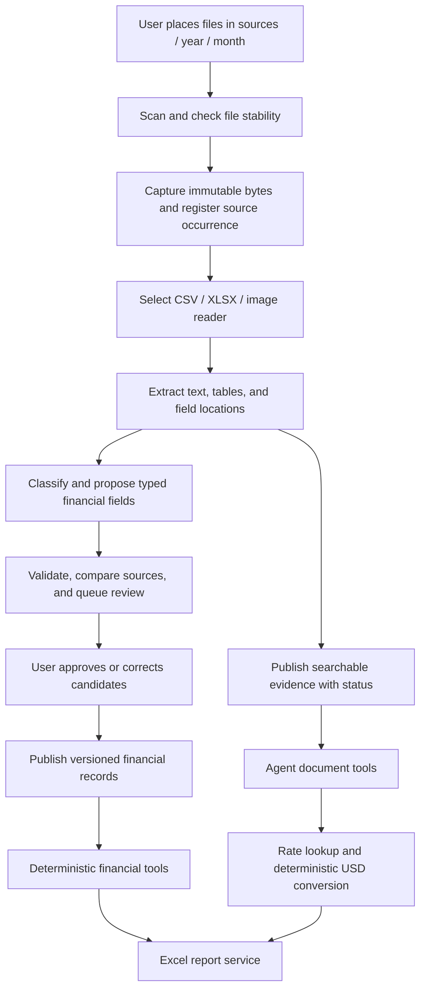

# Directory-based document reading

Implementation update: a separate, configurable [financial reasoning stage](financial-reasoning.md) now analyzes saved vision transcriptions with field-level citations and durable history. Below, proposed review, posting, automatic filing and multi-document analysis remain future work.

Decision update, 2026-09-24: image reading uses a local vision model strictly for text extraction. OCR execution and label-based field inference are removed. A separate reasoning model, to be selected by the user, will consume saved text for fields, titles and classification. Earlier OCR-first and judge-cascade proposals below are superseded by this separation. See [current extraction behavior](receipt-parsing.md).

Status: component design, updated 2026-09-22. D1–D2 and an initial PNG/JPEG receipt reader are implemented. See [receipt parsing](receipt-parsing.md) for the implemented scope and limitations; broader model assessment and review slices remain planned. CSV, Excel, scanned bills and PDF statements are required follow-up readers. Extends [the architecture](architecture.md) and [milestones](milestones.md). See [manual testing](manual-testing.md) for the local UI. No personal source directory is created automatically.

## Purpose and boundary

Detailed decisions for the next content-reading slices are in [Document parsing](document-parsing.md): evidence contracts, readers, interpretation, jobs/migrations, worker confinement, and the manual-review interface.

Turn documents placed in a dedicated year/month directory into preserved, searchable evidence and reviewable financial candidates. A deterministic ingestion worker owns discovery and reading. The agent uses typed tools over indexed evidence and validated records; it does not browse the filesystem or reread an entire directory for every question.

The folder hierarchy is a useful organization and discovery boundary. It is not a financial ledger or proof of completeness. A file in September can contain August transactions, an October due date, and a September statement closing balance.

## Directory contract

Example only; the actual location is configurable and outside the repository:

```text
HomeManagerData/
  sources/                      # user-managed input; application reads only
    2026/
      08/
        bank-statement.csv
        credit-card-statement.xlsx
        grocery-receipt.jpg
        electricity-bill.png
      09/
        ...
  managed/                      # application-managed, private
    originals/                  # immutable byte snapshots keyed by hash
    extracted/                  # versioned text/tables/transcription line references
    work/                       # bounded temporary processing space
    database/                   # SQLite records, jobs, search metadata
  reports/                      # generated Excel reports; never scanned as input
```

**Removed 2026-09-25:** the `YYYY/MM` source folder no longer exists; documents enter only through `Library/Inbox` (see [managed library](managed-library.md)).

Original design: accept `YYYY/MM`, with zero-padded months `01` through `12`. Filenames need not follow a naming convention. Optional type subfolders beneath a month may be accepted, but the user does not have to sort receipts separately from statements. Record the relative path and folder year/month as source metadata. Flag misplaced files or invalid month folders in the scan report rather than silently guessing their month. The worker never moves, renames, edits, or deletes user input files.

Use distinct configurable source and managed roots. Reject overlapping roots, network locations for the initial design, and traversal through symbolic links or Windows reparse points. Reports and internal artifacts cannot enter the source scan. Recognized generated report manifests/hashes also flag accidental manual re-imports for review; do not rely solely on a filename to detect them.

## Processing flow



### 1. Discover and register

Start with a local UI command, **Scan documents**, optionally scoped to a folder month. Run the scan as a durable background job with a returned job ID; never keep a request open while parsing the full directory. Later add a scheduled rescan and optional filesystem watcher. Watch events are hints: a reconciliation scan remains the source of truth for discovery and catches missed events or files added while the application was stopped.

Only configured roots are scanned. Ignore temporary/lock/download files such as `~$...`, `.tmp`, `.part`, and `.crdownload`. Enumerate unsupported files too, recording a reason, so a scan can explain everything found. Use file-size and modification-time stability checks over a configurable interval plus before/after-copy checks. Locked or changing files are deferred, not imported as empty data. Stability is a heuristic; validate the captured format and retry a changed/incomplete file.

Hash bytes while capturing into managed temporary storage, then publish an immutable snapshot only after copy/consistency checks pass. Parse the snapshot, never the changing source path. Save a durable capture state so a crash between file publication and database commit can be reconciled on restart. Repeated scans use metadata to prioritize work but hashes establish content identity; a force/full verification option catches same-size or preserved-timestamp edits.

### 2. Identify occurrences and versions

Separate these concepts:

| Record | Meaning |
| --- | --- |
| Source occurrence | A path under a configured root, folder period, observation times, and the captured content hash |
| Document/blob | One preserved set of bytes with format and content hash |
| Extraction run | Reader/model/schema versions and outputs for that exact document |
| Financial candidate | Proposed typed values with evidence locations and validation state |
| Financial record | Approved normalized fact with links to evidence and approval/revision history |

Identical bytes at another path create another source occurrence, not duplicate transactions or unnecessary transcription. Renaming or moving a file changes occurrence metadata, not financial dates. Different bytes at the same path create a new version candidate; they do not silently replace previously approved facts. Missing files on a later scan mark source occurrences unavailable but do not delete captured evidence or records. If a new version is a correction, review determines what it supersedes.

Content hashing does not solve financial duplication: a CSV, workbook, and image can represent the same purchase with different hashes. Handle those links later using stable transaction identifiers and reviewed matching rules. A statement export and a overlapping statement export must not double-count repeated rows.

### 3. Read by file format

File format and document type are independent. An XLSX may contain a bank statement, a bill, or several different sheets. Verify actual file structure against the extension before selecting a reader.

| Reader | Extracts | Important boundary |
| --- | --- | --- |
| CSV | Rows, columns, original cell strings, row/column coordinates, encoding/delimiter metadata | Versioned per-layout mappings specify account, dates, signs and currency; ambiguous encoding/date/decimal conventions require review |
| XLSX | Sheets, cells, values, formulas as inert evidence, stored values, cell coordinates | Preserve identifiers/leading zeros and date conventions; no macro, external-link, or formula execution; financial formula results require review |
| Scanned image | Local vision transcription, line references and model/version; no invented text coordinates | Preserve original image; preprocessing is a derivative; do not treat confidence as proof of amount/date/currency correctness |

V1 begins with CSV, XLSX, PNG, and JPEG; any additional extension needs a tested reader. Bills and statements describe semantic document types, not an implicit requirement to parse PDFs. If PDF sources are later added, provide native-text reading and local vision transcription of scanned pages as a separate reader milestone. Encrypted, unsupported, corrupt, or resource-exceeding files remain visible with a clear status.

Apply byte, expanded-size, sheet/row/cell, pixel, runtime, and output limits. Process one extraction job at a time initially on the Windows host, scheduling vision and reasoning requests to avoid model memory contention. A plain subprocess is not automatically a security sandbox: implement restricted permissions and network isolation explicitly before using untrusted parsers with private real data.

### 4. Separate interpretation (future)

The vision model transcribes visible text only. It does not choose titles, folders, dates, currencies or totals. No preliminary OCR pass or OCR fallback remains. CSV/XLSX readers will preserve structured evidence directly when implemented.

A separate local reasoning model will consume saved text and evidence IDs and propose typed fields, titles and classification. Persist interpretation independently with its source run and model version. Do not rewrite source evidence to fit candidates. Missing/ambiguous facts stay unresolved; validation and review precede financial publication.

### 4a. Quality assessment (future)

Evaluate transcription on local labeled documents spanning languages, faded text, decimal/sign errors, clipping and unfamiliar layouts. A text reasoning model cannot verify pixels it never saw. Missing/unreadable evidence requires inspection or a better scan; agreement between models is not proof of correctness. Optional judge evaluation can be revisited after the transcription/reasoning separation works.

### 4b. LangChain boundary and local execution

Use LangChain for local model invocation, typed output handling and composition of these bounded stages. Wrap Laya's native inference interface as a local runnable/adapter rather than assuming it exposes a chat-completions API. Keep routing policy, financial rules, ingestion job persistence, approval and provenance in application services. LangChain's structured-output facilities validate shape, not factual accuracy ([official structured-output documentation](https://docs.langchain.com/oss/python/langchain/structured-output)).

Pin and contract-test the installed LangChain/adapters against the actual local endpoints. Configure explicit capabilities and bounded retries rather than relying on automatic provider inference. Do not use hosted LangSmith tracing or cloud model fallbacks. Use the existing SQLite job checkpoints rather than adding a second persistence system just for orchestration.

For future model composition, schedule primary text-model and vision-model requests with explicit memory admission on the 16 GB VRAM / 32 GB RAM host. Do not assume both large models can remain loaded together. Model unload/reload is acceptable when needed for accuracy. VLM choice remains a dedicated capability/accuracy spike; this design does not assert that either existing text-model candidate can read images.

Minimum semantic types: bank statement, credit-card statement, receipt, bill, and unknown. Preserve component-level types for mixed workbooks or multi-receipt images; do not force all content into one transaction. Basic reading can produce searchable evidence even when financial extraction is not supported for that layout.

| Type | Candidate facts | Financial meaning |
| --- | --- | --- |
| Bank statement | Account identity, statement period, opening/closing snapshots, individual postings | Posting candidates and balance evidence; a closing balance is not an expense |
| Credit-card statement | Account identity, period, purchases/refunds/fees, payments, statement balance, minimum payment and due date | Purchases/fees may be spending; paying the card is normally a transfer, not another purchase |
| Receipt | Merchant, purchase date, currency, total, tax and optional line items | Purchase evidence; match an existing posting or review as a standalone expense |
| Bill | Issuer, account/invoice reference, service period, amount due, currency, due date | An obligation, not proof of payment or automatically posted spending |

Store field-level provenance, not just a document-level citation. A total points to a CSV row, workbook cell, or image bounding box. Keep raw value, normalized candidate, parser/mapping version, any model version, validation issues, and review decision. Never ask the model to silently fill missing totals, transaction rows, or account identifiers.

### 5. Validate and review

Validate schemas, date/currency ambiguity, sign conventions, required fields, supported precision, and duplicate candidates. Reconcile statement rows against balances using the relevant account convention where enough evidence exists. Check receipt arithmetic only when sufficient fields are available; a mismatch is a review issue, not permission to replace the source total. A successful arithmetic check alone does not establish correctness.

Keep folder period, document issue date, statement coverage, transaction/posted date, purchase date, and due date as separate fields. Folder mismatch generates a warning without changing dates or moving the file. Queries for spending use approved transaction-date policies; queries for 'documents in September's folder' use folder metadata. Statements spanning months are found by coverage overlap across all indexed folders.

The review screen shows source evidence beside proposed values and explains each blocking issue. Initial V1 requires approval for new financial import batches, with explicit review of all transcription-derived financial facts. Reusable mappings reduce review effort without removing provenance or validation. Approval is an authenticated application command, unavailable to the model. Publish a document/import batch transactionally; partial approval must be explicit, with excluded rows and incomplete coverage retained.

Do not make searching dependent on approval. Text can become searchable as soon as a bounded successful extraction is published, labeled as unreviewed evidence. Only approved financial records feed authoritative totals. Correcting a candidate does not modify the original and triggers downstream conversion/matching invalidation when amount, currency, or date changes.

### 6. Convert and link evidence

During agent analysis of a foreign-currency receipt, call `lookup_exchange_rate(currency, USD, valuation_date)`, then `convert_document_amount(candidate_id, field_id, rate_id)`. Follow the historical ECB and rounding policy in the architecture. Keep provisional conversions separate from approved records. The application retains the exact rate ID so later reports can reproduce the result.

Prefer an actual validated USD settlement where it represents the same purchase; retain the foreign receipt as evidence. Proposed receipt/posting links need review before changing financial representation. Conversion is not proof of payment, and an unpaid bill remains an obligation even if its USD equivalent is known. A statement's foreign transactions are converted individually by their applicable dates, not all at the folder month-end rate.

## Status, recovery, and coverage

Use distinct status axes rather than one ambiguous 'processed' flag:

- Capture: discovered, waiting-for-stability, captured, missing-at-source, rejected.
- Extraction: queued, running, succeeded, partial, unsupported, failed.
- Financial review: not-applicable, needs-review, approved, rejected, superseded.
- USD conversion: not-needed, pending, resolved, unresolved, invalidated.

Jobs have attempts, leases, heartbeat/expiry, stage checkpoints, timestamps, and structured errors. Deduplicate jobs by document hash, stage, and relevant parser/config version. Reprocessing with a new parser creates new staged outputs; it never replaces approvals automatically. Retry transient failures within a budget; unsupported formats and bad schemas require action rather than endless retries. Logical quarantine records a status and isolates processing; it does not move the user's file.

A month dashboard shows last scan time, discovered/captured files, extraction failures, review backlog, unresolved conversions, and document counts by type/account. Distinguish 'all discovered files processed' from 'all expected financial evidence received.' A coverage register can record expected accounts/statements and known date ranges. An empty folder does not prove zero spending; approved snapshots do not prove complete transaction history. Reports must carry these limitations.

## Application commands and agent tools

| Interface | Caller and behavior |
| --- | --- |
| `scan_inbox()` | Authenticated UI command; captures files placed directly in Library/Inbox and returns a job ID (replaced `scan_source_directory`) |
| `get_ingestion_status(job_id or folder_period)` | UI and read-only agent tool; status, counts, issues and scan freshness |
| `list_documents(filters, cursor)` | UI and read-only agent tool; distinguish folder period, document type, extracted date/coverage, and review state |
| `search_documents` / `get_document` | Agent retrieves bounded indexed evidence by ID and location; document content remains untrusted |
| Review/approve/reject/reprocess commands | Authenticated UI only; explicit revisions and audit trail |
| Financial, matching, FX and report tools | Existing service boundaries; consume document IDs and approved records, not arbitrary filesystem paths |

Avoid exposing the scanner as a general filesystem agent tool. In V1, a user initiates scanning from the UI; later the scheduler can ingest additions without an LLM deciding which files exist. A query seeing stale ingestion status should disclose it rather than pretending it covers a newly added file.

## Example: analyzing September

The user adds a bank CSV, credit-card XLSX, a euro receipt image, and an electricity bill image to `sources/2026/09/`, then selects Scan documents.

The worker captures four originals, reads structured rows, transcribes the two images with the vision model, and makes the extracted content searchable. It proposes postings, balance snapshots, a receipt, and a bill; each retains its own actual dates. The user reviews the candidates. The receipt is matched to a card posting if supported, avoiding duplicate spending; the bank payment to that card is treated as a transfer when confirmed. The electricity bill remains an obligation until payment evidence exists.

For a foreign receipt needing conversion, the agent looks up the applicable historical rate and calls the deterministic conversion tool. When asked for a September report, financial services select approved September records across the entire database, including any located in other folder months. The Excel tool writes a new report containing USD totals, original amounts, evidence and rate references, plus unresolved-source warnings. It never overwrites an input workbook.

## Small implementation slices and acceptance criteria

| Slice | Deliverable | Independent acceptance test |
| --- | --- | --- |
| D1 | Directory contract, scan inventory, stability handling and durable captures | Nested month files discovered; incomplete/locked files deferred; repeated scan does not duplicate captures; sources remain byte-identical |
| D2 | Version/occurrence tracking and recovery | Copy, rename, delete, and overwrite scenarios preserve evidence and approvals; crash after capture recovers without duplicate jobs |
| D3 | CSV/XLSX readers and extraction schema | Exact source coordinates and values; unsupported formats and formulas handled explicitly; no model required |
| D4 | Local vision transcription and evidence | Text-only contract, retained text, visible unreadable markers, bounded images and no OCR fallback |
| D4a | Local Laya adapter, LangChain stage composition and shadow-mode assessments | Bounded evidence, versioned scores, unsupported-language/context handling, no hosted requests; compare judgments to human labels |
| D4b | Local text/vision escalation and calibrated routing | Exact-image evidence preserved; critical-field errors and false acceptance measured; model outage/disagreement forces review; memory-safe local execution |
| D5 | Typed candidates and review UI | Bank/card/receipt/bill semantics preserved; ambiguous dates/currencies blocked; unreviewed evidence cannot affect totals |
| D6 | Matching, FX, and existing report integration | No duplicate receipt/card expense or card-payment spend; rate ID reused; partial coverage disclosed; cross-month dates handled correctly |

D1-D4 establish basic capture and reading. D4a-D4b remain future assessment work after separate reasoning; D5-D6 make its results safe and useful for financial tasks. These refine M2/M2b/M3/M3b and the model-adapter milestones. Parser/vision tests use small synthetic fixtures; no actual household documents enter Git or hosted evaluation services.
