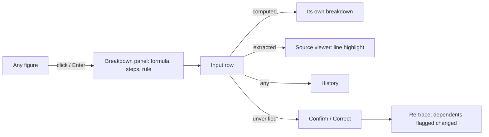

# Home Manager: UI redesign plan (calculation observability first)

> **Delivery note.** Plan mode only allows writing this harness plan file. Once the plan is approved, the one action is
> to copy this text unchanged to `ui_redesign_plan.md` in the repo root. No app files change. Each later phase still
> gets its own per-screen hand-off, written with `.claude/skills/ui-redesign/references/plan-template.md`.
>
> **Evidence.** Paths are relative to `src/home_manager/` unless they start with `docs/`, `tests/` or `.claude/`.
> Static files are in `app/static/`. Migration line numbers are in `library/migrations/050_strict_tables.sql` unless
> another file is named. Discovery was read-only and never touched `P:\Finances`, `P:\EvalCorpus` or
> `%LOCALAPPDATA%\HomeManager`. Where a search found nothing, this plan says **not found**.

---

## 1. Executive summary

Home Manager's backend is unusually careful:
- Money is stored as integer minor units (`core/money.py:1,32`).
- Every extracted value must cite a verbatim line (`documents/extraction.py:328,584`).
- Tax engines carry versions and citations (`finance/engines/opentax.py`, `taxcalc.py` `PINNED`).
- Many calculations already return `how`, `notes` and `sources`.

The UI can't show most of that. Explanations come in five different shapes (`how`, `notes`, `reason`, `match_method`,
`issues`), and there is no common trace object (**not found**). So only a few screens can explain a number: the pay
stub, the paycheck planner and the tax return lines.

Three things undercut the principle:
- **The browser still does math.** About 25 places do arithmetic, including the donut slices drawn apart from their
  labels, the bills overdue grouping and the badge totals.
- **Provenance has holes.** No table records who made a change, corrections without a reason cover only 3 record types,
  and new vision runs keep no image geometry.
- **Overrides are invisible.** Tax inputs typed by hand silently replace gathered values, with no history kept.

**Direction:**
1. The backend gets a recursive **Trace** contract, built by the same code path that computes each figure.
2. Seven observability components render it the same way everywhere.
3. Navigation is regrouped by goal: Today, To check, Money, Taxes, Wealth & plans, Home, Records.
4. Everything stays on the existing vanilla JS stack, migrated screen by screen behind a flag, with a numeric parity
   harness.

**Biggest risk:** traces built *beside* the calculations instead of *from* them. A parallel explainer drifts the same
way frontend math does. The trace recorder must sit inside the real functions, and parity tests must compare the trace
result with the displayed figure.

---

## 2. Inventories

### 2.1 Feature inventory

Columns: feature | backend home | where it shows in the UI | reachability.

| Feature | Backend | UI surface | Reachability |
|---|---|---|---|
| Capture (Inbox, watched folders) | `library/` scanner; `/api/inbox-scans`, `/api/sources` | Processing (`app.js:415,430-464`) | OK |
| Reading documents (vision, PDF, CSV/XLSX) | `documents/`; `/api/documents/{id}/receipt-runs` | Document page, Processing "Read all" | OK; CSV/XLSX can't be opened (docs/open-work.md:128) |
| Typed extraction | `documents/extraction.py`; `/extraction-runs` | Document page (`receipt.js:916`) | OK |
| Reasoning runs | `/api/documents/{id}/reasoning-runs` (api.py:768,1177,1182) | **none** | API only, by design (docs/documents.md:348) |
| Independent reviewer | `documents/reviewer.py`; `PUT /api/reviewer-settings` (740) | Document page check panel (`receipt.js:408-427`); Settings shows status only | **Settings can't be changed in the UI** (PUT has no caller) |
| Decision models | `models/decisions.py`; `POST /api/decision-model-tests` (1206) | Settings "Local models" | Test endpoint has no UI |
| Multi-receipt split, image grouping | segments/groups APIs | Document page, Review side panel | OK |
| Duplicate links ("Also found") | in the document payload; also `GET /api/documents/{id}/links` (697) | `receipt.js:106-108` | OK (standalone endpoint unused) |
| Library, trash, filing, organization | `library/`; `/api/documents/...`; organization-runs (1680,1684) | Documents (`library.js`) | Organization runs: **no UI** |
| Full-text search | FTS5; `/api/search` | Search (`search.js:47`) | OK |
| Ledger (transactions, statements, receipts, bills, pay stubs) | `finance/ledger.py` | Transactions, Receipts & statements, document page | OK |
| **Manual transaction entry** | schema allows `origin='manual'` (050:1424) | **not found** (no write path, no form) | **missing** |
| CSV/XLSX statement import | `finance/` import; `POST /api/finance/accounts` (801) | Documents → Import (`index.html:485`) | Hard to find: not on Accounts (open-work.md:128) |
| Reconciliation and matching | `finance/reconcile.py` | Review "Proposed matches", statement prompt (`finance.js:618-661`), Processing | OK; "Reconcile now" means two things (open-work.md:120) |
| Categories, rules, item splits | `finance/splits.py`, rules | Transactions drawer, Spending rules panel | OK |
| Budgets and pace | `tools.get_budgets:556` | Spending (`finance.js:392-438`), Home | OK |
| Recurring bills and subscriptions | `reconcile.py:472-579`, `tools.py:635,660` | Bills (`finance.js:512-580`), Review | OK |
| `POST /api/finance/bills/{id}/payment` | api.py:846 | none | **Remove**: stale (open-work.md:136) |
| Accounts and balances | `tools.get_accounts:276`, `get_account_balance:284` | Accounts (`finance.js:585-612`) | Read-only |
| Currency conversion (ECB) | `finance/fx.py` | Taxes rates, totals' `usd_total` | Partly shown |
| Dashboard | `finance/dashboard.py:63` | Home | OK |
| Family dashboard, net worth, routing, inbox | `finance/family.py`, `family_routing.py` | Home (family), Review routing | OK in family mode only |
| Forecast | `finance/forecast.py:283,391`, `charts.py` | Forecast | OK |
| What If scenarios, plan tracking | `finance/scenarios.py`, `plan_tracking.py` | What If | OK |
| Paycheck planner | `finance/paycheck.py:199` | What If → Paycheck planner | OK |
| Investments (CDs, I bonds, 529, crypto, pensions, lots, RMD) | `finance/investments.py`, `tax_lots.py`, `retirement.py`, `prices.py` | Investments | OK, dense |
| Taxes (gather, engines, Tax Zen, safe harbor, write-offs, family) | `finance/tax_*.py`, `tax_zen.py`, `safe_harbor.py` | Taxes | OK |
| Tax businesses edit/delete | `PUT/DELETE /api/tax/businesses/{id}` (960,964) | none (only POST is called) | **Can't edit or delete** |
| Tax tags on receipts or items | `GET /api/tax-tags/on/{type}/{id}` | only `transaction` is called (`finance.js:278`) | **Partly unreachable** |
| Tax tables (AI lookup + confirm) | `household/tax_tables.py` | Review "Tax tables to confirm", What If | OK |
| CPA pack | `finance/cpa_pack.py` | Taxes (`/api/tax/cpa-packs`) | OK |
| Ledger health check | `finance/health.py:58`; `GET /api/finance/health` (791) | **none** (CLI `check-ledger` only) | **Unreachable from UI** |
| Inventory, check-ins, returns, warranties | `household/` | Inventory, Home panels | OK |
| Item analysis (unit price, waste, anomalies) | `household/analysis.py` | Ask panel tools only | **No screen** |
| Ask assistant | `assistant` tools | Ask panel (`assistant.js`) | OK |
| Profiles, families, sharing, backup | `app/profiles.py`, `family_sync.py` | Settings tabs | OK |
| Family GPU relay admin | `models/gpu_host.py` | none | CLI only, by design |
| Donate documents and evals | `donate.js`; `evals/` | Donate | OK |
| Model runs and jobs telemetry | `/api/model-runs`, `/api/jobs` | Processing | OK |

**Also unused:**
- `GET /api/receipt-runs/{id}/pages/{n}`, `/api/receipt-batches/{id}`, `/api/activity`, `/api/item-resolution-runs/{id}`,
  `/api/receipts/{id}/items` and `/api/documents/{id}/image`: covered by other calls or internal. Keep them.

### 2.2 Screen and route inventory

Routes come from `ROUTES` (`shell.js:3-27`). The sidebar is built in `index.html:30-72`.

| Route | Shows | Main actions | Reached from |
|---|---|---|---|
| `#/home` | Net spending, money in, net cash flow; trend bars; category donut; Needs attention; upcoming bills; maturities; warranties; returns; budgets; check-in; family table and net worth | Month/currency, Refresh, drill-down links | Sidebar 2 (default) |
| `#/search?q=` | Hits grouped by documents, transactions, items, accounts | open hit | Sidebar search, Ctrl+K, / |
| `#/review` | Queue in 9 groups (`review.js:10-12`) + detail; groups, routing, unmatched | Confirm/Reject (V/R), Reconcile, Undo | Sidebar 3 with badge |
| `#/transactions` | Items/Charges table, filters, pager, drawer | Category, rule, Count it/Reject, tax tag | Sidebar 4, Home, Spending, Search |
| `#/receipts` | Library in money scope | Read, combine, move, delete, import | Sidebar 5 |
| `#/spending?month` | Per-currency figures, budgets, comparison, merchants, refunds, rules | Budget edit, rules | Sidebar 6 |
| `#/bills` | Overdue / 7 days / later; subscriptions; recurring table | Confirm, Not recurring, Ended, kind, scan | Sidebar 7 |
| `#/accounts` | Balances by type, as-of, Stale | none | Sidebar 8 |
| `#/investments` | Summary, accounts, RMD, form checks, gains, I bond rates, crypto | Add account, holdings, lots, events, rates, prices, Coinbase import | Sidebar 9 |
| `#/taxes?year` | Tax Zen, return lines, engine compare, inputs, write-offs, CPA pack, rules, businesses; family | Edit inputs, tags, CPA pack, rates | Sidebar 10 |
| `#/forecast` | Assumptions, assets/loans, starting point, 3 SVG charts | Run forecast, assets | Sidebar 11 |
| `#/whatif?stub` | Plans, follow plan, compare, paycheck planner | CRUD scenarios, adopt, compare | Sidebar 12, document page (pay stub) |
| `#/inventory?q` | Check-in, groups, receipts to identify, return policies | Answer, undo, warranty lookup | Sidebar 13 with badge |
| `#/documents?status&q` | Folder tree, filters, table | Read, combine, move, delete, import | Sidebar 14, Inbox/Unfiled |
| `#/documents/ID` | Source pane + record pane, checks, history | Read, Extract, Verify/Reject, edit, segments | Many links; **no sidebar entry** |
| `#/processing` | Pipeline lanes, jobs, model runs, watched folders | Scan, Read all, Reconcile, Cancel | Sidebar footer |
| `#/settings` | 8 tabs (`shell.js:36`) | Many | Sidebar footer, profile icon |
| `#/donate`, `#/donate/ID` | Checks and redaction | Check, bundle | Sidebar footer |
| Ask panel | Assistant drawer | Ask | Footer, Ctrl+J |
| `#/finances?…` | Legacy redirect (`finance.js:36-42`) | — | old links |

In family view only `FAMILY_ROUTES` show (`shell.js:47,50`): home, settings, review, receipts, documents, document,
processing, whatif and taxes.

### 2.3 Calculation inventory

**Legend.**
- Input sources: **M** manual, **AI** AI-extracted, **Im** imported, **C** computed, **R** rule table or constant,
  **Ext** external rate or price.
- "Explain?" asks whether the UI shows a breakdown today.
- "FE dup?" asks whether the frontend repeats or derives the figure.

**Ledger and spending**

| Calculation | Where computed | Inputs | Sources | Displayed | Explain? | FE dup? |
|---|---|---|---|---|---|---|
| Account balance | `finance/tools.py:284` | latest statement closing balance | AI, Im | Accounts, forecast start | Partial (as-of, Stale) | No |
| Net spending, refunds, from-receipts | `tools.py:351,410` | countable txns + standalone receipts + shares | AI, Im, C | Home metrics, Spending | Partial (notes, coverage) | No |
| USD consolidation | `tools.py:403` → `fx.py:217` | foreign lines, ECB rates | C, Ext | Spending, cashflow | No (rate ids not shown) | No |
| Monthly series | `tools.py:424` | `_totals` | C | Home trend | No | **Yes**: scale, max/min (`home.js:67-85`) |
| Category totals | `tools.py:438,454` | `category_splits` or txn category | AI, M, C | Home donut, Spending | No | **Yes**: slice share (`home.js:122`) |
| Category share % | `dashboard.py:48-59` | category totals | C | Home legend | No | **Yes** (`home.js:122` vs `row.share`) |
| Item split allocation | `splits.py:32,47,84`; `ledger.py:442` | receipt items, tax, tip, charge | AI, C | Item view, categories | No | No |
| Shared part of a charge | `ledger.py:61` (SQL) + `:72` (Py) | `record_shares` | M (routing) | "your part" (`finance.js:157`) | Partial label | No |
| Period/category comparison % | `tools.py:92,528,545` | totals | C | Spending | No | No |
| Cash flow | `tools.py:611` | outflow + inflow lines | AI, Im | Home | Partial (coverage) | No |
| Budget used, pace, % | `tools.py:556` | `budgets` + category totals + bills due | M, C | Spending, Home | Partial (status) | **Yes**: meter cap (`finance.js:392`), over/left sign (`finance.js:438`) |
| Unmatched receipts | `tools.py:724` | receipts | AI | Review panel | Yes (reason) | No |
| Dashboard snapshot | `dashboard.py:63` | all of the above | C | Home | Partial ("What these numbers cover") | see above |
| Family dashboard | `family.py:41,66` | members' dashboards | C | Home (family) | Partial (per-member) | No |

**Bills, matching, household**

| Calculation | Where computed | Inputs | Sources | Displayed | Explain? | FE dup? |
|---|---|---|---|---|---|---|
| Recurring monthly/yearly cost | `tools.py:635-646` | obligations | AI, C | Bills | No (formula in notes only) | No |
| Upcoming/overdue bills | `tools.py:660` | next due, amount | C | Bills, Home | Partial | **Yes**: overdue/7-day grouping (`finance.js:514-519`) |
| Bill expected amount (avg of last 3) | `reconcile.py:579,72,58` | counted payments | AI, Im | Bills | No | No |
| Cadence detection | `reconcile.py:472,513,558` | ≥3 payments, contract terms | AI, Im | Review, Bills | Partial (`confidence_source`) | No |
| Match score | `reconcile.py:96-451` | amounts, dates, names | AI, Im | Review | Yes (signals), score in Details | No |
| Cross-currency estimate | `reconcile.py:235` | ECB | Ext | Review | No | No |
| Return window | `household/items.py:294,318` | printed days or policy | AI, M | Inventory, Home | Partial (source) | **Yes**: "recent" 14 days (`inventory.js:29`) |
| Warranty expiry | `household/warranty.py:56,73,179` | manual or web lookup | M, AI | Home, Inventory | Partial (quote) | No |
| Item analysis | `household/analysis.py:129-278` | approved item lots | AI, C | Ask only | No screen | No |

**Forecast and planning**

| Calculation | Where computed | Inputs | Sources | Displayed | Explain? | FE dup? |
|---|---|---|---|---|---|---|
| Forecast baseline | `forecast.py:283` | balances, cashflow, categories, assets, pay | AI, Im, M, C | Forecast starting point | Partial (notes) | No |
| Monthly projection, net worth | `forecast.py:391,636` | assumptions | M, C | Forecast charts and table | Partial (rows) | Chart scale only (server SVG) |
| Family net worth | `family.py:118` | baselines | C | Home (family) | Partial | No |
| Scenario run/compare | `scenarios.py:185,205` | scenarios | M, C | What If | Partial (notes) | No |
| Paycheck gross→net | `paycheck.py:199` | inputs + tax tables | M, AI→M confirmed, R | What If | **Yes** (`how` per row) | **Yes**: bp→% (`whatif.js:117`) |
| Plan vs actual | `plan_tracking.py:94,131` | scenario + stubs + categories | M, AI, C | What If "Follow this plan" | Partial | No |

**Investments**

| Calculation | Where computed | Inputs | Sources | Displayed | Explain? | FE dup? |
|---|---|---|---|---|---|---|
| CD/T-bill/bond accrual | `investments.py:129` | holding terms | AI, M | Investments | No ("estimated" label) | No |
| I bond value, cash-out | `investments.py:151-197` | user-entered rates | M, R | Investments | Partial | No |
| Totals and share % | `investments.py:528,110` | confirmed values | AI, M, C | Investments | No | No |
| Holding gain | `investments.py:593,627` | statement cost basis | AI | Investments | No | No |
| FIFO lots, realized gains | `tax_lots.py:57,109` | events + manual lots | AI, Im, M | Investments, Taxes | Partial (`missing`) | No |
| Form vs recorded | `investments.py:1327,1341` | 1099 boxes vs events | AI | Investments | Yes (difference) | No |
| 529 earnings | `investments.py:1379` | events + 1099-Q | AI | Investments, Taxes | Partial | No |
| RMD | `investments.py:1407` → `retirement.py:34` | Dec 31 value, birth year | AI, M, R | Investments | Yes (divisor, balance) | No |
| Crypto value | `prices.py:53,155` | units × CoinGecko | AI, Ext | Investments | Partial | No |

**Taxes**

| Calculation | Where computed | Inputs | Sources | Displayed | Explain? | FE dup? |
|---|---|---|---|---|---|---|
| Gather return inputs | `tax_year.py:203,104,71` | stubs, forms, tags, assets | AI, C, M | Taxes "What it's built from" | **Yes** (kind + source) | **Yes**: paydays without a stub (`taxes.js:458`) |
| Typed overrides merge | `tax_year.py:365-394` | typed inputs | M | Taxes | Partial ("You typed") | No; **no history, no original kept** |
| Mortgage average balance | `tax_year.py:157,173` | 1098, loan | AI, R | Taxes | Yes (Pub 936 text) | No |
| Federal return (Engine 1) | `engines/opentax.py:64,278` | ReturnInput | C, R | Taxes lines | **Yes** (`how` + citation) | No |
| Federal return (Engine 2) | `engines/taxcalc.py:124,282` | ReturnInput | C, R | Taxes compare | Partial | No |
| State return (simplified) | `tax_return.py:46,156` | state tables | AI→M, R | Taxes | Partial ("Simplified") | No |
| Marginal rate | `tax_return.py:147` | brackets | R | Taxes | No | **Yes**: bp→% (`taxes.js:405`) |
| Payments, Additional Medicare | `tax_engine.py:148` | jobs | C, R | Taxes | Partial | No |
| Safe harbor | `safe_harbor.py:32,44` | tax, payments, prior year | C, M, R | Tax Zen | Yes (basis, quarters, `RULES_VERSION`) | No |
| Tax Zen goal, status, W-4 solve | `tax_zen.py:86-443` | estimate, policy, jobs | C, M | Taxes, Home | Partial (reason, range) | **Yes**: sign wording, "$0" (`taxes.js:310-351`) |
| Advance tax quarters | `tax_zen.py:170` | needed, payments | C | Tax Zen | Partial | No |
| Likely range | `tax_year.py:338` | projected parts | C | Tax Zen | Partial (confidence word) | No |
| Pay-stub tax explanation | `paystub.py:61,89,102,144,170` | stub lines + tables | AI, R | Document page | **Yes** (buckets, difference) | **Yes**: `planRate` copy (`receipt.js:834,852`) |
| Write-off counted amounts | `tax_tags.py:31,80,322` | tags, split shares | M, AI, R (50% meals) | Taxes write-offs | Partial (notes) | **Yes**: counted ≠ amount (`taxes.js:20`) |
| Family return combine | `tax_family.py:51` | members | C | Taxes family | Partial | No |
| CPA pack totals | `cpa_pack.py:52-254` | as above | C | file download | Manifest | No |

**Checks**

| Calculation | Where computed | Inputs | Sources | Displayed | Explain? | FE dup? |
|---|---|---|---|---|---|---|
| Extraction cross-checks | `extraction.py:717-978` | extracted fields | AI | Review issues, document Checks | Yes (issues) | **Yes**: "X of Y confirmed" (`receipt.js:416`) |
| Ledger health | `health.py:58` | ledger | C | **none** | No | No |

**Other browser-side derivations:**
- Review badge, a sum of 9 requests (`review.js:22-30`).
- Search total (`search.js:66`).
- Employer folder total (`library.js:110`).
- succeeded = total − failed (`library.js:344,425`, `inventory.js:115`).
- Confidence % rounding (`receipt.js:418,422`).
- bp → % (`review.js:229-230`).
- Forecast default date in UTC (`forecast.js:193`; a correctness bug).

### 2.4 Data provenance today

**What exists:**
- **Document link + cited lines:** `financial_evidence_links` (050:346) stores `document_id`, `blob_hash`,
  `parse_run_id` and `locator_json {line_ids, quotes}`. It covers statement, transaction, receipt, receipt_item, bill
  and income_record.
- **Model:** reachable through `extraction_run_id` → `extraction_runs.model_identity` (050:306) →
  `model_identities.model_id` (050:774). It's plain TEXT with no FK, and it isn't on records directly.
- **Origin:** `transactions.origin` import/extraction/manual (050:1424); `category_source`; `source` columns on
  investment tables, holdings, tags, warranties, tax tables.
- **Review state:** `review_status` + `review_source` (user/automatic) on most ledger records. `review_events`
  (050:1121) logs status changes.
- **Corrections:** `record_corrections` (050:1052) keeps `field, value, previous, created_at` for receipt, bill and
  income_record only.
- **Rules:** tax engine version + `pin_sha256` in `tax_calculations` (058); `safe_harbor.RULES_VERSION`; FX `rate_id` +
  `set_sha256`; tax table rows carry `year`, `filing_status` and `sources_json`.

**What is missing.** Each of these blocks a UI requirement.

| Requirement | Missing in backend | Evidence |
|---|---|---|
| "Entered manually by whom" | **No actor column anywhere.** Search for `created_by\|updated_by\|actor\|reviewed_by\|profile_id` → not found. One database per profile only implies the person. | migrations 001–060 |
| Override: original, new, who, when, **why** | No reason column. Corrections only for 3 record types. **Transactions** (category overwritten in place, `ledger.py:742-752`), statements, valuations, tax form boxes, holdings and budgets have no history. **Typed tax inputs** replace gathered values with no stored original or history (`tax_year.py:365-394`). | 050:1052-1061 |
| AI value: which model | Derivable through the joins, but no API returns it on a field. | 050:306,774 |
| AI value: confidence | No per-field confidence on ledger tables. Only `item_resolutions.confidence` (050:635), `tax_zen_evaluations.confidence` (060:20), and reviewer doubts inside `extraction_runs.result_json` (`extraction.py:1012,1025`). | — |
| Source region (image box) | Records store line ids, not boxes. **New vision runs write no geometry** (`receipt_worker.py:110` `blocks=[]`; `pdf_reader.py:72` `block_ids=[]`). Polygons exist only for barcodes and paper regions. Pages are only implicit in PDF line ids (`pdf_reader.py:36`). | — |
| Timestamps on child rows | `receipt_items`, `receipt_rewards`, `income_lines`, `tax_form_boxes` have **no created/updated**. | 050:957,976,391; 059:4 |
| Rule version and CPA review | Tax tables: `TAX_TABLE_VERSION` is a constant not stored on rows (`household/tax_tables.py:29`). Unversioned constants: supplemental rates (`paycheck.py:43`), meals 50% (`tax_lines.py:35`), RMD table (`retirement.py:16`), mortgage limit, AOTC, `NO_PENALTY_BELOW`. Only HSA limits are year-keyed (`tax_year.py:44`). A **CPA-reviewed flag is not found** anywhere. | — |
| Computed-at / staleness of a figure | Only tax calculations persist (`tax_calculations`, `tax_zen_evaluations` with `inputs_hash`). Every other figure is computed on request with no input hash, so "input changed since" can't be detected. | — |
| Unverified propagation | Partial: `get_spending` returns `pending_review` and coverage. There's no general count of AI-unconfirmed inputs per aggregate. "Checked automatically" (`review_source='automatic'`) records count in totals as trusted. | `ledger.py:40-64` |
| Family routing decider | `family_assignments` has no actor. | 050:329 |

### 2.5 Users and access

- **Deployment:** one person per Windows computer. The server binds `127.0.0.1` only (`__main__.py:39`) and checks Host
  and Origin, with a random bearer token per launch (`app/api.py:515-543`).
- **No logins, roles or permissions** (not found). Profiles are explicitly *not* access control (docs/family.md:29).
- **Remote family access:**
  - Members don't connect to another member's server.
  - Family data travels as AES-256-GCM encrypted read-only copies through a shared folder (`app/family_sync.py:1-17`),
    plus encrypted inbox deliveries and `.hmshare` snapshots.
  - The only network listener is the GPU relay (Tailscale only, `models/gpu_host.py:423-432`).
- **User types and their jobs:**

| User | Job |
|---|---|
| Household owner (power user) | Sets up libraries, models and tax inputs; reviews AI output; plans taxes, investments, forecast |
| Family member on their own computer | Checks spending and bills, confirms their own documents, sees the family view |
| Family owner | Routes inbox documents, reads the combined family dashboard and family taxes |
| CPA (indirect) | Receives the CPA pack; never uses the app |

### 2.6 Tech stack

- Plain JS, 18 classic `defer` scripts sharing one global scope (`index.html:8-25`). No framework, no build step.
- `api()` fetch wrapper (`app.js:53-61`), `tool()` (`finance.js:4`). Settings poll every 1.5 s (`app.js:301-329`).
- State in module globals plus the URL hash. CSS custom properties (`style.css:6-25`), no dark theme.
- Strict CSP (`api.py:541`). Charts are hand-built SVG (`home.js`) or server SVG (`charts.py`).
- Helpers in `ui.js` (`amount`, `dateText`, `statusBadge`, `emptyState`, `alertBox` …). Duplicates:
  `asyncButton`/`actionButton`, and 5 table builders.

**Recommendation: keep the stack.** It already enforces "server text only". A framework would cost a build step, a
CSP rework and a rewrite of about 18 files and 20+ browser tests, an estimated 4–6 weeks before any observability gain.
Nothing in the trace UI needs reactivity beyond what DOM factories give.

---

## 3. Audit findings

**Severity:**
- **Critical:** a user could act on a number they can't verify, or that could be wrong.
- **High:** a core gap.
- **Medium:** friction.
- **Low:** polish.

### Observability

| ID | Sev | Finding | Evidence |
|---|---|---|---|
| O1 | **Critical** | Typed tax inputs override gathered values silently. The original isn't kept, so the user can't see what the records said or undo it, and the W-4 advice depends on it. | `tax_year.py:365-394` |
| O2 | **Critical** | Totals include AI-extracted records that only "checked automatically" with no visible unverified state on the total. Tax Zen W-4 advice builds on these stubs. | `ledger.py:40-64`; `review_source` automatic; `taxes.js:304-380` |
| O3 | **Critical** | Three bracket-tax implementations and two marginal-rate definitions. The pay stub, planner and return can disagree for the same income. | `tax_return.py:46,147`; `paystub.py:116-132`; `taxcalc.py:203,215` |
| O4 | **Critical** | Two RMD calculations: the page uses the newest verified value; the forecast uses available values including estimates. Two different "required" amounts for a penalty-bearing deadline. | `retirement.py:34` vs `forecast.py:622-631` |
| O5 | **Critical** | Two quarterly-underpayment computations with different rounding and bases (safe harbor vs advance tax). | `safe_harbor.py:55-67` vs `tax_zen.py:173-196` |
| O6 | High | Donut slices are computed in the browser while labels use the server share, so the slice and the % can disagree. | `home.js:122-127` |
| O7 | High | Bills overdue/7-day grouping is computed in the browser, so the "Overdue" state isn't server truth. | `finance.js:514-519` |
| O8 | High | No common trace object. Explanations come in 5 ad hoc shapes; most figures (spending, categories, budgets, investment totals, recurring cost) can't be broken down at all. | §2.3 "Explain?" column |
| O9 | High | Model, confidence and editor aren't exposed per value. A user can't tell which model read a number or who changed it. | §2.4 |
| O10 | High | CPA pack "Wages" sums records only; the return uses typed overrides. The pack the CPA sees can disagree with the return. | `cpa_pack.py:102` vs `tax_year.merge` |
| O11 | High | Merchant spending has two definitions (top merchants includes receipts and shares; anomalies uses the raw amount). | `tools.py:458` vs `analysis.py:278` |
| O12 | High | Tax rule constants are unversioned, with no CPA-review state. Users see a tax figure with no rule year. | §2.4 |
| O13 | Medium | Recurring monthly-equivalent is written three times; loan roll-forward twice with different rounding. | `tools.py:646`, `forecast.py:365,488`; `forecast.py:565` vs `tax_year.py:157` |
| O14 | Medium | About 20 smaller browser derivations: bp→% in four different roundings, sign stripping, badge sums, the "X of Y confirmed" subtraction, the paydays subtraction. | §2.3 last paragraph |
| O15 | Medium | Raw `.display` text bypasses `amount()`, so one page shows both "$1,234.56" and "1,234.56 USD". | `home.js:55`; `finance.js:418-466`; `forecast.js:147-162`; `taxes.js:304-380` |
| O16 | Medium | Source region highlights work only for old OCR runs. New runs can highlight a text line but not an image box. | `receipt.js:327-331`; `receipt_worker.py:110` |
| O17 | Medium | Ledger health exists but is invisible in the UI. | `GET /api/finance/health` (api.py:791), no caller |
| O18 | Low | Hard-coded "$0", "0.00 USD", "($)". | `taxes.js:229,293,310,398`; `whatif.js:30,211-214` |

**What works and should be kept:**
- Pay-stub "How your taxes were figured" (`receipt.js:791-840`).
- Taxes input kinds with sources (`taxes.js:271-279`).
- Engine `how` with citations.
- Review match signals in words.
- Document-page cited-line highlighting both ways (`receipt.js:254-296`).
- Accounts "as of" with no cross-account total.
- The assistant's "Check these figures" warning (`assistant.js:49-85`).

These are the seeds of the component library.

### Workflow

Steps were counted from code paths: clicks, page changes and waits. Screens are distinct routes or panels.

| ID | Sev | Workflow | Today | Where users get lost |
|---|---|---|---|---|
| W1 | **Critical** | Correct a wrong value | Transactions: drawer → category only. Statement, valuation and tax-form values: **no edit path**. Typed tax inputs: edit overwrites with no history. | Can't fix a wrong statement amount or a 1099 box at all (not in CORRECTABLE, `ledger.py:101-107`) |
| W2 | High | Add a transaction | **Not possible** (no manual entry found). Workaround: import a CSV through Documents → Import (about 6 steps, 3 screens). | Import isn't on Accounts (open-work.md:128) |
| W3 | High | Upload and confirm a document | Save the file to the Inbox outside the app → Processing → Scan Inbox → Read all → wait → Review (badge) → select → (optional) Open document → V. About 8 steps, 3–4 screens. | Review's buttons sit under a late-loading thumbnail (open-work.md:119). The badge (limit 1000) and the queue (limit 200) disagree (open-work.md:113). "Reconcile now" is ambiguous. |
| W4 | High | Check the tax estimate | Taxes → read Tax Zen → scroll to return lines → scroll to "What it's built from" → open folds. About 5 steps, 1 long screen. | The answer is spread across a long page. Unverified stubs aren't flagged in the headline. Overrides aren't distinguished from records in the result. |
| W5 | Medium | Review a month | Home (month select) → Needs attention is below the charts → Spending (separate month state, not in the URL, open-work.md:125) → Transactions with filters → drawer. About 6 steps, 3 screens. | The month is lost between pages. Category drill-down passes ignored params (open-work.md:114). |
| W6 | Medium | Check a bill | Bills → overdue group (browser-computed) → no link to the matched payment. About 3 steps. | Can't see *why* a bill is "overdue · no payment found" (which payments were considered). |
| W7 | Medium | Understand a spending total | Not possible beyond "What these numbers cover". | Dead end. |

### Structural

| ID | Sev | Finding | Evidence |
|---|---|---|---|
| S1 | High | Navigation follows build order: Investments, Taxes, Forecast and What If sit under "Money"; Donate sits beside Processing; "Receipts & statements" and "Documents" are the same page with two entries. | `index.html:45-70`; `library.js` scope |
| S2 | High | Missing loading/error states: Bills and Accounts have no try/catch; Investments can stick on "Loading…"; Forecast and Taxes fall back to a toast; Spending and Transactions are blank when unconfigured. | `finance.js:512,585`; `investments.js:14-15`; `forecast.js:198` |
| S3 | High | STATUS map has a duplicate `due` key: "Due"/neutral is overridden by "Coming due"/info, so bills show the wrong label. | `ui.js:76,92` |
| S4 | Medium | Date formatting bypasses `dateText` in 7+ places; `Intl.NumberFormat` is never used (fine), but the formats vary. | `app.js:123,218`; `home.js:148-197`; `forecast.js:148` |
| S5 | Medium | Filters are lost on reload (Documents, Inventory, Spending month, Forecast, Settings tab). | open-work.md:125 |
| S6 | Medium | Duplicate helpers (`asyncButton`/`actionButton`, 5 table builders); hard-coded chart hex values. | `home.js:4,85`; `style.css:420-422` |
| S7 | Medium | Explanations use three mechanisms (inline muted text, `title=`, `<details>`) with no popover component. | §2 agent findings; `ui.js:183` |
| S8 | Low | Open bugs #1–8 in docs/open-work.md:107-117. #5 and #7 are confirmed present. | — |
| S9 | Low | Forecast default date uses UTC, so it is off by one in the evening. | `forecast.js:193` |

---

## 4. Calculation trace model (backend prerequisite)

### 4.1 Schema

The schema is returned by a new `GET /api/traces/{ref}`. It is built in a new `core/trace.py`.

```jsonc
{
  "ref": "spending.net?month=2026-09&currency=USD",   // stable, URL-safe; also the figure's key
  "label": "Net spending, September 2026",
  "result": {"minor": -184233, "currency": "USD", "decimal": "-1842.33", "display": "1,842.33 USD"},
  "formula": "Purchases counted this month, minus refunds. Transfers and pending lines aren't counted.",
  "steps": [                                            // ordered; running is the value after this step
    {"n": 1, "label": "Card and bank purchases", "op": "+", "value": {...money}, "running": {...money},
     "trace": "spending.purchases?…", "count": 42},
    {"n": 2, "label": "Receipts with no matching charge", "op": "+", "value": {...}, "running": {...}, "trace": "…"},
    {"n": 3, "label": "Refunds", "op": "−", "value": {...}, "running": {...}}
  ],
  "rounding": {"method": "half_even_minor", "adjustment": {...money}|null,
               "note": "Each line converted, then summed"},
  "inputs": [                                           // leaf values; aggregates point to their own traces
    {"key": "txn:812", "label": "Costco · Sep 3", "value": {...money},
     "provenance": {
       "kind": "extracted|imported|manual|computed|override|rule|rate",
       "document": {"id": 55, "lines": ["page-1-line-12"], "quote": "TOTAL 84.12", "page": 1, "region": null},
       "model": {"id": "qwen2.5-vl-7b", "run": "ex_…", "at": "2026-09-04T…"},   // extracted only
       "confidence": {"level": "doubted|unchallenged", "by": "independent check"} | null,
       "import": {"file": "chase-sep.csv", "row": 14} | null,
       "actor": {"profile": "Anirudh", "at": "…"} | null,       // manual/override
       "override": {"original": {...money}, "reason": "…", "history": "corrections:…"} | null
     },
     "verification": "verified|unverified|rejected", "trace": null}
  ],
  "inputs_page": {"total": 42, "next": "…"},           // large input sets are paged; steps never are
  "rule": {"name": "Pub 15-T percentage method", "source": "IRS Pub 15-T (2026)", "citation_url_text": "…",
           "version": "pub15t-2026-1", "tax_year": 2026, "checked_on": "2026-09-28", "cpa_reviewed_on": null} | null,
  "computed_at": "2026-10-04T14:03:11Z",
  "inputs_hash": "sha256:…",
  "stale": false,                                       // true when the hash of current inputs ≠ the stored one
  "verification": {"state": "verified|partial|unverified",
                   "unverified_count": 3, "unverified_value": {...money}, "first": "txn:812"},
  "reconciles": true                                    // Σ steps + rounding.adjustment == result, asserted server-side
}
```

**Figure envelope.** Every number an API returns becomes a `figure`: the existing `money()` dict plus
`"trace": "<ref>"` and `"verification": "verified|partial|unverified"`. This extends `money()` (`core/money.py:100`)
through a new `figure()` helper. Old fields stay, so screens that haven't migrated keep working.

### 4.2 How traces are produced (anti-drift rule)

- **A `Recorder`.** Its methods are `step()`, `input()`, `rule()` and `round()`. It's passed as an optional argument
  into the *existing* functions. A no-op recorder is the default, so the hot paths don't change.
- **Lazy traces.** `GET /api/traces/{ref}` re-runs the same function with a live recorder. Payloads stay small, which is
  progressive disclosure on the wire.
- **Reconcile and parity checks.** The `reconciles` assertion fails loudly in tests. A test asserts
  `trace.result == figure` for every trace ref.

### 4.3 Provenance backend changes (new migration range from 061)

| ID | Change | Why |
|---|---|---|
| B1 | `record_corrections`: widen `record_type` to transaction, statement, investment_valuation, tax_form_box, holding, budget; add `reason TEXT`, `actor TEXT` | overrides with original/new/who/why (O1, W1) |
| B2 | New `tax_input_changes(year, key, gathered_json, typed_json, reason, actor, created_at)`; `tax_year.merge` returns the gathered value beside the typed one | O1 |
| B3 | `actor` on `record_corrections`, `review_events`, `family_assignments`, `budgets` history, `tax_input_changes`, manual transactions. Its value comes from a **who's-here picker** (D1): the person chosen for the session, sent as an `X-HM-Actor` header and validated against the profile's people (the profile owner, or family members in a family). | "by whom" |
| B4 | Add `created_at`/`updated_at` to `receipt_items`, `receipt_rewards`, `income_lines`, `tax_form_boxes` | timestamps |
| B5 | `provenance_for(record_type, id, field)` resolver: joins evidence links → parse run → model identity; reads reviewer doubts from `extraction_runs.result_json`; derives the page from the line id | model, confidence, page |
| B6 | New `rule_sources` table + registry module: every constant set (brackets via tax_tables, supplemental, meals 50%, RMD table, HSA, mortgage, AOTC, safe harbor) gets `version, tax_year, source, checked_on, cpa_reviewed_on`. Store `TAX_TABLE_VERSION` on tax table rows. | O12 |
| B7 | `figure_snapshots(ref, inputs_hash, result_minor, computed_at)` written when a trace is opened or a figure is shown on Home/Taxes | stale detection |
| B8 | Verification roll-up with **three states** (D2): `confirmed` (`review_source='user'` or imported), `checked_automatically` (`review_source='automatic'`), `needs_review`. Only `needs_review` inputs flag a total as unverified; the automatic ones get a quieter label inside the breakdown. | O2 |
| B9 | Manual transaction entry: `POST /api/finance/transactions` with origin `manual` + actor. **Counts at once** (D9); a statement line matched to it later replaces it, the way receipts work today (`ledger.py:43` STANDALONE rule) | W2 |
| B10 | Geometry for new runs: **not built** (D5). The source viewer shows the page (from the line id) + the cited line highlighted in the text pane + the quote. Old OCR polygons still draw where present. | O16 |
| B11 | **Family ledger read API**: transactions, spending, bills and accounts across members' `view\` copies, applying the existing counted-once rules (docs/family.md "Counted once"), each row carrying `owner` | D3 |
| B12 | **Family → member corrections channel** (new; today data flows only member → family): an encrypted correction delivery (same format as inbox deliveries, docs/family.md "Delivery"), queued in the member's outbox on the family hub (B14). The member's app pulls it, applies it as a `record_corrections` row with actor + optional reason, and the member can reject it in Review. Conflict rule: if the member changed the same field after the family's copy was taken, the delivery becomes a Review question instead of applying. | D3 |
| B13 | **Documents to the family computer, over Tailscale** (D10): members' apps push the documents cited by their records to the hub (B14) in the background. The transfer is incremental by blob hash, so unchanged files aren't re-sent. The family computer keeps them **cached**, encrypted at rest with the family key, so the family view shows originals while the member's computer is off. Shows a progress status, and a consent note that every family member can see every original. | D3 |
| B14 | **Family hub over Tailscale; the shared folder is retired** (D10). The family computer runs a hub listener bound **only** to its Tailscale address. It reuses `models/gpu_host.py`: `make_server` (refuses anything outside 100.64.0.0/10), `tailnet_address()`, and per-member bearer tokens stored only as SHA-256 (`add_member`/`remove_member`). It has no loopback exemption for remote calls. **Everything moves to it:** members push their database copy (the existing AES-256-GCM `.hmfamily` format, kept as defense in depth) and documents (B13), and pull deliveries and corrections from their outbox (B12). The hub runs only while the app is open (D11); both sides queue while the other is offline and retry. The document cache has no size cap (D13). `.hminvite` carries the hub's tailnet address + the member's token. Existing shared-folder families get a one-time switch: the member re-joins with a new invite, and the old folder files are ignored after that. **Security change:** docs/family.md:29-30 says families exchange data "never through a network listener". That statement changes, so it needs a security review, tests for refusals (wrong token, non-tailnet bind, replay, wrong family) and updates to docs/family.md and docs/operations.md. | D10 |

### 4.4 Calculations to refactor to return traces

Effort: S ≤ 1 day, M 2–4 days, L ≥ 1 week.

| Calculation | Function | Effort | Notes |
|---|---|---|---|
| Net spending / refunds / cashflow | `tools._totals:351`, `get_spending:410`, `calculate_cashflow:611` | M | step per bucket; inputs paged |
| USD consolidation | `fx.consolidate:217` | S | per-line rate ids already exist |
| Category totals + shares | `tools._category_totals:438`, `dashboard.group_categories:48` | M | shares returned as `share_bp` + text; **donut geometry uses `share_bp` only** |
| Item split allocation | `splits.allocate:47` | M | largest-remainder adjustment becomes `rounding.adjustment` |
| Budgets / pace | `tools.get_budgets:556` | S | add `meter_percent` (capped server-side) |
| Recurring cost, upcoming bills | `tools.py:635,660`; `reconcile.track_bills:579` | S | add `group: overdue|week|later` server-side |
| Account balance | `tools.get_account_balance:284` | S | one input (the statement line) |
| Forecast baseline + projection | `forecast.py:283,391` | L | many steps; trace per month on demand |
| Investments totals, accrual, I bond, lots, RMD | `investments.py:129-1407`, `tax_lots.py`, `retirement.py` | L | unify the RMD paths first (A-P0-5) |
| Tax gather + overrides | `tax_year.py:203,365` | M | with B2 |
| Federal return lines | `opentax.shaped:278`, `taxcalc.shaped:282` | M | map existing `how` + citation into steps/rule; merge the duplicate shaping |
| Safe harbor, Tax Zen, advance tax | `safe_harbor.py`, `tax_zen.py` | M | after one quarterly method (A-P0-6) |
| Pay-stub explanation, paycheck planner | `paystub.py:170`, `paycheck.py:199` | S | already rich; reshape |
| Write-off totals | `tax_tags.py:322` | S | |
| CPA pack wages | `cpa_pack.py:102` | S | use merged values; trace link in the manifest |

---

## 5. Information architecture

The tree below is organized by goal. Every existing feature maps to a place in it.

```
Search (Ctrl+K)
Today                          #/home         answer first: what needs you, this month, bills due, tax status
To check                       #/review       one queue (Review) + "Being read" strip (Processing summary)
Money
├─ This month                  #/spending     spending, budgets, categories → drill to Transactions
├─ Transactions                #/transactions (+ Add transaction, Import)
├─ Bills & subscriptions       #/bills
└─ Accounts                    #/accounts     (+ Import statement)
Taxes                          #/taxes        tabs: This year (Tax Zen + estimate) · Built from · Write-offs ·
│                                             Jobs & pay stubs · CPA pack · Rules & sources
Wealth & plans
├─ Investments                 #/investments
├─ Forecast                    #/forecast
└─ What If                     #/whatif       (plans, paycheck planner)
Home & things                  #/inventory    tabs: Check-in · Items · Warranties · Returns · Item insights
Records
├─ Receipts & statements       #/receipts     kept as its own entry (D6)
├─ Documents                   #/documents
└─ Document page               #/documents/ID
──── footer ────
Ask (Ctrl+J)
Processing                     #/processing   (+ Data health tab)
Settings                       #/settings
Donate documents               #/donate       (moves under Settings › Help the project; route kept)
Who's here: <person>           picker (D1)
```

**Family view** (D3): Today, To check, Money (This month, Transactions, Bills, Accounts), Taxes, What If, Records,
Processing and Settings. Every list row shows its owner and a filter by person. Edits go through B12.

**Feature → new home** (anything not listed keeps its current place):

| Feature | New home |
|---|---|
| Receipts & statements (`#/receipts`) | Kept as its own entry under Records (D6) |
| Reconcile now | To check (the statement prompt) and Processing (the run); renamed "Match receipts" vs "Check statement" |
| Ledger health (backend-only) | Processing › Data health, plus trace-level `reconciles` flags |
| Item analysis (Ask-only) | Home & things › Item insights (P2) |
| Reviewer settings PUT | Settings › Independent checks |
| Decision-model test | Settings › Local models › Test |
| Tax businesses edit/delete | Taxes › Built from |
| Tax tags on receipts/items | Document page item rows + Transactions drawer |
| Manual transaction | Transactions › Add |
| CSV/XLSX import | Accounts › Import statement, and Transactions › Import |
| Reasoning runs, organization runs | Document page › Details (technical) |
| `POST /api/finance/bills/{id}/payment` | **Remove**: bills aren't payment-tracked (open-work.md:136) |
| Family dashboard / routing / net worth | Today (family view) / To check / Wealth |
| Family ledger (new, D3) | Family view › Money: Transactions, This month, Bills, Accounts, editable through B12 |
| GPU relay admin, `index-documents` | Stay CLI (operator tasks) |

`FAMILY_ROUTES` keep their meaning, mapped onto the new routes.

---

## 6. Redesigned workflows

| Workflow | New flow | Steps before → after | Observability in it |
|---|---|---|---|
| **W3 Upload & confirm** | Drop the file on any page or Documents (a new drop target that writes to the Inbox) → reading starts automatically → toast "Read · 1 to check" → To check → the item with the source beside it → V | ~8 / 3–4 screens → 4 / 2 | Each field shows a provenance badge (AI · model · doubted?); unverified fields marked; Find highlights the line |
| **W1 Correct a value** | Open any traceable number → breakdown → the input row → **Correct** → new value + optional reason (D8) → saved as an override. In the family view this sends a B12 correction to the member. | not possible for most → 3 | Override badge shows original → new, who, when, why; dependent figures re-trace and flag "changed since" |
| **W4 Tax estimate** | Taxes › This year: headline answer (refund/owe, range, unverified count) → "How we got this" → steps → open any input | ~5, long scroll → 2 to the answer, 3 to any input | Rule source/version/tax year; `cpa_reviewed_on`; unverified inputs listed first; typed overrides shown beside gathered values |
| **W5 Review a month** | Money › This month (month in the URL, shared with Transactions) → category row → filtered Transactions → drawer | ~6 / 3 → 3 / 2 | Every total traceable; components sum visibly; "3 receipts not yet confirmed" on the total |
| **W2 Add a transaction** | Transactions › Add (account, date, payee, amount, category) | not possible → 2 | Badge "Entered by <profile>, <date>" |
| **W6 Check a bill** | Bills row → trace: "next due = last due + cadence; no counted payment in window (payments considered: …)" | 3, no why → 2 with why | Server-side group; match window visible |
| **W7 Understand spending** | Click any total → breakdown | not possible → 1 | the full trace |



---

## 7. Screen specifications

Level 0 is the default view, L1 is one interaction away, L2 is two.

**Today (`#/home`)**: for everyone; the answer first.
- L0:
  - "Needs you: 5" with the top three, first above the fold.
  - This month's net spending (traceable) with an unverified chip if any.
  - Bills due in 7 days.
  - A tax status sentence ("On track for about $0 · range …").
  - Charts move below.
- L1: breakdown panel for any figure; category list.
- L2: inputs and sources.
- States:
  - empty (no library → setup);
  - loading (skeleton rows);
  - error (`alertBox` + Retry);
  - unverified (chip "includes 3 unconfirmed");
  - stale (a "changed since <time>" chip from B7).

**To check (`#/review`)**: owner and members. The current 2-pane layout and J/K/V/R stay **as they work well**.
- Adds:
  - a provenance badge per field;
  - "affects: Net spending Sep, Tax estimate" (dependents from trace refs);
  - Correct with a reason.
- The decision bar stays fixed at 1366×768.
- States: empty "All caught up", loading, error inline (the queue doesn't advance), an item is stale (re-read).

**Document page**: the two-pane source-beside-record **is kept**.
- L0: fields with badges.
- L1: Find highlights the line (and the region when geometry exists).
- L2: the History tab shows corrections with reasons and review events with actors.
- The Read and Record steps move to the record header (open-work.md:119).

**Money › This month (`#/spending`)**
- L0: net spending, budgets with server meter %, top categories.
- L1: category trace → transactions.
- L2: each input's provenance.
- Shows per-currency totals plus the USD total with its rate-ids trace.

**Transactions**
- Table amounts use `amount()`.
- The drawer gets a Provenance section (replaces "Details"), History, and Correct.
- Add/Import in the toolbar.

**Bills & subscriptions**
- Server `group`; the row opens a trace ("why overdue").
- Fix the STATUS `due` collision.

**Accounts**
- Balance traceable to its statement line (an input with a document link).
- Still no cross-account total (docs/ui.md "Decisions" 4, **kept**).
- Import statement added.

**Taxes**: the same view for every family member (D3).
- L0: result + range + an "unverified inputs" count + "Rules: 2026 tables, checked 2026-09-28, not CPA-reviewed".
- L1: return line steps (from the engine `how`).
- L2: input provenance, overrides beside gathered values, engine version/pin.
- States:
  - engine unsupported (fallback shown with its reason);
  - stale (inputs changed since the last calculation, from `tax_calculations.profile_hash`);
  - Engine 1 vs 2 disagreement.

**Investments, Forecast, What If**
- Totals traceable.
- Estimated values carry the "Computed · estimate" badge.
- Forecast results come first (open-work.md "Round two"); its traces are per month.

**Processing**: pipeline lanes are kept, and a Data health tab is added (`/api/finance/health`).

**Settings**: tabs are kept; Independent checks becomes editable; Donate moves here.

**Every screen** uses one `pageState()` helper for loading, error and empty. That fixes S2.

---

## 8. Observability component library

These are vanilla factory functions in a new `app/static/trace.js`, loaded after `ui.js`. They use tokens only and are
CSP-safe.

1. **`figure(fig, {size})`**: a traceable number.
   - Wraps `amount()`.
   - Renders a `<button class="figure">` with `aria-haspopup="dialog"` and an `aria-describedby` verification text.
   - A dotted underline appears on hover and focus only, which keeps the default view calm.
   - Unverified: a ◐ icon + "unconfirmed" text after the value, never color alone.
   - Stale: a ↻ icon + "changed".
   - Enter/click opens the breakdown. No `trace` ref → a plain `amount()`. **Never** a figure with no backend
     explanation.
2. **`breakdownPanel(ref)`**: a non-modal side panel.
   - At 1440 it opens beside the content; under 900 it's a bottom sheet.
   - Fetches `/api/traces/{ref}`.
   - Contents in order:
     - Answer + formula sentence.
     - A steps table (n, label, op, value, running), all `amount()` with tabular figures.
     - A rounding row when the adjustment isn't null.
     - A **"Sums to"** footer showing the result, with a ✓ when `reconciles`.
     - Inputs (paged; unverified first).
     - The rule card.
     - "Calculated <time> · inputs unchanged / changed since".
   - Each computed input pushes a breadcrumb: recursive and keyboard-navigable. Esc goes back.
3. **`provenanceBadge(prov)`**: icon + text, routed through the `STATUS` map with new kinds:

   | Kind | Icon | Text |
   |---|---|---|
   | manual | pencil | "Entered by Anirudh · Sep 3" |
   | extracted | scan | "Read by model · Sep 3" + doubted? |
   | imported | file-input | "Imported · chase-sep.csv row 14" |
   | computed | sigma | "Worked out" (links to the trace) |
   | override | pencil-line | "Changed from 84.12 · reason" |
   | rule | book | "IRS Pub 15-T 2026" |
   | rate | arrows | "ECB rate Sep 3" |
4. **`unverifiedMark()` + `confirmCorrect(input)`**:
   - Confirm = the same endpoint as Review V.
   - Correct = an inline form with value, an **optional** reason (D8), and a live preview of the affected figures
     (server computes them).
   - On save, "Undo for 8 s", the same as Review.
5. **`sourceViewer(doc, lines, region?)`**:
   - Reuses the document page's highlight code (`receipt.js:254-331`) as a panel.
   - Shows the page, the cited line highlighted in the text pane and the quote (D5). It draws an image region only
     where an old OCR polygon exists.
   - In the family view it shows another member's document from the hub cache (B13), and until it has arrived "The
     original hasn't reached this computer yet".
   - Text read from documents stays text (no live links).
6. **`historyList(record, field?)`**:
   - Reads corrections, review events and tax input changes.
   - Each entry shows when, who, from → to, why. Newest first.
7. **`ruleCard(rule)`**:
   - Shows name, source as text, version, tax year, checked on, and CPA review state ("Not CPA-reviewed" shown plainly).

---

## 9. Design system foundations

The visual direction comes from Phase 0 of the `ui-redesign` skill (MASTER.md, with Pro Max). These rules are fixed
now:
- **Currency.** Server `display` only, through `amount()`. Home currency shows its symbol; others show the ISO code;
  minor-unit precision per currency. Remove every hand-typed "$" (O18).
- **Negatives.** Money out: `−` (U+2212) in a fixed-width sign slot, default text color. Money in: `+` and `--positive`.
  Never parentheses in the UI. The CPA pack may keep its own accounting format.
- **Tabular figures** on every number, and right alignment in tables and the steps table.
- **Rounding display.** Show the server's rounding row whenever its adjustment isn't null ("Rounding: +0.01"). Never
  hide a cent.
- **Percentages.** The server returns `*_percent` text with the precision chosen per figure (0.1 by default). The four
  browser bp→% conversions are removed.
- **Dates.** `dateText`/`dateDisplay` only. ISO in provenance. Relative time only for "calculated 3 min ago".
- **Color.**
  - Existing meanings are kept (accent = interactive, green = money in/verified, red never spending).
  - Verified/unverified/stale/override each get an icon + text.
  - Charts must pass a non-color check (pattern or label).
  - The dark theme is added through tokens.
- **Type.**
  - Tabular sans for figures.
  - `--figure-lg` for the one headline figure per page.
  - The breakdown panel uses `--text-sm` with steps in a monospace-free tabular sans.
- **Spacing:** the 4px scale is kept.
- **Accessibility:**
  - WCAG 2.2 AA.
  - Figures are buttons with an accessible name ("Net spending 1,842.33 dollars, includes 3 unconfirmed, show
    breakdown").
  - The panel traps no focus (non-modal) but returns focus to its trigger.
  - Every step table has `<th scope>`.
  - 200% zoom; reduced motion.

---

## 10. Migration strategy

1. **Backend first, invisible.**
   - The trace contract and recorder are added, with `figure` fields on existing payloads.
   - No screen changes.
   - Parity tests: for every trace ref, `trace.result == figure` and `reconciles`.
2. **Flag per screen.**
   - The setting `ui_v2_screens` is a list in `/api/settings`.
   - The shell reads it and loads the v2 render function for that route; the v1 function stays.
   - Both coexist because the pages are separate loader functions (`loadHome`, `openSpending`, …).
3. **Numeric parity harness.**
   - A new `tests/test_ui_parity.py`, browser, synthetic seed only.
   - For each migrated route, it collects every `[data-figure-ref]` in v2 and every amount node in v1 (by `data-raw`,
     which `amount()` already sets as a tooltip and which becomes an attribute).
   - It asserts:
     - the same set of displayed values;
     - each equals `GET /api/traces/{ref}.result.display`;
     - no figure lacks a ref.
   - A v1 screen is deleted only after parity passes at 390/768/1440 and the user approves.
4. **Order:** foundation → Taxes → Today → To check → document page → Money screens → Wealth → the rest.
5. Each screen gets its own plan-template hand-off, before/after `ui_shots.py`, and one commit (when asked).

---

## 11. Action items

Priorities: **P0** blocks observability or correctness; **P1** core redesign; **P2** polish.

| ID | Pri | Description | Files | Effort | Depends | Done when |
|---|---|---|---|---|---|---|
| A1 | P0 | Trace contract: `Recorder`, `figure()`, `GET /api/traces/{ref}` | `core/trace.py` (new), `core/money.py`, `app/api.py` | M | — | A unit test traces a 3-step sum, `reconciles` is true, and the ref round-trips |
| A2 | P0 | Unify bracket tax and marginal rate into one function | `tax_return.py`, `paystub.py`, `engines/taxcalc.py` | M | — | One `bracket_tax`; the old call sites use it; existing tax tests pass; a new test makes pay stub, planner and state agree for one income |
| A3 | P0 | Overrides: B1 + B2 (corrections widened, reason, tax input history); gathered value returned beside the typed one | migration 061, `ledger.py`, `tax_year.py`, `api.py` | M | — | Correcting a statement amount or a tax input stores the original + reason; GET returns both |
| A4 | P0 | Provenance resolver B5 + actor B3 + timestamps B4 | migrations, `finance/provenance.py` (new) | M | A3 | `provenance_for` returns model, page, quote and doubt for an extracted test field |
| A5 | P0 | One RMD computation used by the page and the forecast | `retirement.py`, `forecast.py`, `investments.py` | S | — | The forecast's year-one RMD equals `/api/investments/rmd` in a test |
| A6 | P0 | One quarterly underpayment method | `safe_harbor.py`, `tax_zen.py` | S | — | One function; Tax Zen and safe harbor quarters agree in a test |
| A7 | P0 | CPA pack wages from merged values | `cpa_pack.py:102` | S | A3 | A pack summary equals the return wages line with a typed override |
| A8 | P0 | Remove browser math: server `share_bp`, `meter_percent`, bill `group`, review counts endpoint, `paydays_without_stub`, `*_percent` texts, checks summary counts; fix the UTC date | `dashboard.py`, `tools.py`, `tax_year.py`, `home.js`, `finance.js`, `taxes.js`, `review.js`, `receipt.js`, `whatif.js`, `forecast.js` | M | — | A Grep for `\.minor\s*[-+*/<>]` and `/ 100` in static finds only chart pixel geometry; tests pass |
| A9 | P0 | Verification roll-up B8 on aggregates (policy per Q2) | `tools.py`, `dashboard.py`, `tax_year.py` | M | A1 | Spending and tax figures carry `verification` and the unverified count in tests |
| A10 | P0 | Rule registry B6 with version, tax year, checked_on, cpa_reviewed_on | `finance/rules.py` (new), migration, `tax_tables.py` | M | A1 | Every tax trace has a non-null `rule` with a version |
| A11 | P0 | Fix the STATUS `due` collision | `ui.js:76,92` | S | — | Distinct keys; the bills test asserts "Due" |
| A12 | P1 | Traces for ledger/spending/budget/bills/accounts | §4.4 rows | M | A1, A9 | Parity test green for Home/Spending figures |
| A13 | P1 | Traces for taxes (gather, engines, Tax Zen, safe harbor, write-offs, pay stub) | §4.4 rows | L | A2, A3, A6, A10 | Every figure on Taxes has a ref |
| A14 | P1 | Component library (§8) | `static/trace.js` (new), `ui.js`, `style.css`, `index.html` | L | A1, A4 | A browser test opens a breakdown, follows a computed input, confirms an unverified input |
| A15 | P1 | Phase 0 design system (MASTER.md) + phase 1 foundation (tokens, dark, fonts, `pageState()`) | `design-system/`, `style.css`, `ui.js` | L | — | MASTER.md approved; ui_shots shows no overflow on every route |
| A16 | P1 | Flag + parity harness (§10) | `shell.js`, `api.py` settings, `tests/test_ui_parity.py` | M | A1 | The harness fails on a seeded mismatch and passes on the real seed |
| A17 | P1 | Taxes v2 screen | `taxes.js`, css | L | A13, A14, A16 | Parity green; W4 in ≤ 3 steps in a browser test |
| A18 | P1 | Today v2 | `home.js` | M | A12, A14 | Needs you is in view at 1366×768; donut geometry from `share_bp` |
| A19 | P1 | To check + document page v2 with Correct + reason | `review.js`, `receipt.js` | L | A3, A4, A14 | The W1 and W3 browser tests pass; J/K/V/R kept |
| A20 | P1 | IA: new sidebar (both Records entries kept), Donate move | `index.html`, `shell.js` | S | A15 | Every old route resolves; the feature map in §5 is covered by a test of nav links |
| A21 | P1 | Manual transaction + Import on Accounts/Transactions | `api.py`, `ledger.py`, `finance.js` | M | A4 | The W2 test adds a transaction with an "Entered by" badge |
| A22 | P1 | Money screens v2 (This month, Transactions, Bills, Accounts) | `finance.js` | L | A12, A14 | Parity green |
| A23 | P1 | Surface hidden features: health tab, reviewer settings, businesses edit/delete, tags on items; remove the bill payment endpoint | `processing.js`, `app.js`, `taxes.js`, `receipt.js`, `api.py` | M | — | Each endpoint in §2.1 marked unreachable has a caller or is removed |
| A24 | P2 | Wealth screens v2 + traces (investments, forecast, What If) | §4.4 | L | A5, A14 | Parity green |
| A25 | P2 | Stale detection B7 | migration, `trace.py` | M | A1 | Changing an input marks the Home figure "changed since" |
| A26 | P2 | Item insights screen; Inventory tabs | `inventory.js` | M | A14 | The analysis tools are reachable without Ask |
| A27 | P1 | Who's-here picker + actor plumbing (D1): picker in the sidebar foot, remembered per session, `X-HM-Actor` validated server-side | `shell.js`, `app.js`, `api.py` middleware, `app/profiles.py` | M | A4 | Every correction, review and manual entry row stores the chosen person; a test rejects an unknown actor |
| A29 | P1 | Family ledger read API B11 + family Money screens | `finance/family.py`, `api.py`, `finance.js`, `shell.js` `FAMILY_ROUTES` | L | A12, A22 | The family Transactions total equals the sum of members' totals (counted once) in a synthetic two-member test |
| A30 | P1 | Family → member corrections channel B12, with the conflict rule | `app/family_sync.py`, `finance/family_routing.py`, `ledger.py` | L | A3, A27, A32 | A correction made in the family applies in the member's library with actor; a conflicting one becomes a Review question |
| A32 | P1 | Family hub over Tailscale (B14), replacing the shared-folder transport for database copies, deliveries and corrections; invite carries the hub address + token; migration for existing families | `app/family_sync.py`, `finance/family_routing.py`, new `app/family_hub.py` (reusing `models/gpu_host.py` bind/token helpers), Settings › Profiles & family, docs/family.md, docs/operations.md | L | — | In a two-process loopback/tailnet test, a member's copy, a delivery and a correction round-trip through the hub; it refuses a wrong token, a non-tailnet bind and a wrong family; queued items sync after the hub comes back |
| A31 | P2 | Documents to the family computer over the hub (B13): background push, incremental by blob hash, cached encrypted at rest, consent note | `app/family_hub.py`, `app/family_sync.py`, Settings › Profiles & family | L | A29, A32 | A member's breakdown shows the original image in the family view while that member's process is stopped; an unchanged document isn't re-sent |
| A28 | P2 | Remove duplicated helpers and table builders; dead CSS; docs/ui.md rewrite | static, docs | M | all screens | No v1 functions remain; docs updated |

---

## 12. Recommended build order

1. **Correctness first (P0 backend):** A11, A2, A5, A6, A7, then A8. These fix wrong or disagreeing numbers before
   anything is explained.
2. **Trace and provenance backbone:** A1 → A3 → A4 → A9 → A10.
3. **Design foundation in parallel:** A15 (Phase 0 MASTER.md, then Phase 1), A16 flag + parity harness.
4. **Components:** A14.
5. **Highest-stakes screens:** A13 + A17 Taxes, then A18 Today, then A19 To check + document page (where corrections
   happen).
6. **Money:** A12, A22, A21, A20 IA switch.
7. **Family:** A27 picker (needed before any shared editing), A32 Tailscale hub (the transport everything else uses),
   A29 family ledger, A30 corrections channel, A31 documents.
8. **Wealth and the rest:** A24, A23, A26, A25.
9. **Cleanup:** A28.

---

## 13. Decisions (resolved 2026-10-04)

| # | Question | Decision |
|---|---|---|
| D1 | Who is "who" | A **who's-here picker**, not just the active profile (A27). |
| D2 | What counts as unverified | **Three states:** confirmed / checked automatically / needs review. Only "needs review" flags a total (B8). |
| D3 | Family view | The family view becomes an **editable combined ledger** used by **every member**. Transactions, Spending, Bills and Accounts span members, each row with its owner (B11). Edits travel back to the member's library through a new corrections channel (B12). **Documents sync too**, so originals show in the family view (B13). Today the family view is totals-only, with no documents from members on other computers (docs/family.md "Families"). |
| D4 | CPA review | No CPA reviews the rules. Show "Not CPA-reviewed" as a **neutral label**, with no warning styling. |
| D5 | Source geometry | **Text-line highlight is enough.** No geometry pass (B10). |
| D6 | Receipts & statements | **Keep both sidebar entries.** |
| D7 | Visual direction | A **fresh Phase 0** with Pro Max: 2–3 directions, then you choose. |
| D8 | Override reasons | **Optional** on every correction. |
| D9 | Manual transactions | **Count right away**; a matching statement line replaces them later. |
| D10 | Family transport | **Tailscale only, for everything.** The shared (OneDrive) folder is retired. Database copies, deliveries, corrections and documents all go through a hub on the family computer (B14). Documents are **copied and kept cached** there (B13). |

| D11 | Hub uptime | The hub runs **only while the app is open** on the family computer. Members' apps queue their copies, documents and pulls, and retry until it's reachable. Settings shows "Waiting for the family computer" with the time of the last sync. |
| D12 | Rejected corrections | **No notice to the family.** The rejection shows up in the family view only when the member's next database copy arrives (the record goes back to its old value, and its History shows "Rejected by <member>"). |
| D13 | Document cache size | **No hard limit.** Settings › Profiles & family shows the cache's size; no cap and no eviction. |

**Still open:** none from this round.

## Earlier open questions (as asked)

- **Q1. Who is "who"?** There are no logins, and profiles aren't access control. Is "Entered by <active profile>" honest
  enough, or do you want a lightweight "who's here" picker on shared computers?
- **Q2. What counts as unverified?** Should records that only *passed automatic checks* (`review_source='automatic'`)
  show as unverified in totals? Strict yes means most totals show the chip until you confirm. The alternative: three
  states (confirmed / checked automatically / needs review), with only the last flagging totals.
- **Q3. How much should family members see?** Should family members see tax-rule detail, other members' traces, and
  inputs (salaries, 1099s), or only the answer + "ask the owner"?
- **Q4. CPA review.** Does a CPA actually review the rules? If so, who records `cpa_reviewed_on`, and should unreviewed
  rules carry a visible warning on tax figures, or just a neutral label?
- **Q5. Source geometry.** Is image-region highlighting worth adding a geometry pass to reading (slower, more model
  work), or are text-line highlights enough?
- **Q6. Merging Receipts & statements into Documents.** Is a filter enough, or do you rely on it being a separate entry?
- **Q7. Visual direction.** Restart Phase 0 with Pro Max, or carry forward the "Household ledger" proposal (docs/ui.md)?
- **Q8. Override reasons.** Required on every correction, or only for tax inputs and statement amounts?
- **Q9. Manual transactions.** Should they count in totals immediately, or need a statement match like receipts?

## Verification of this plan

- **Read-only discovery.** Created only this plan file (and, on approval, `ui_redesign_plan.md`).
- **Claims spot-checked directly:**
  - `ui.js:76,92` (duplicate `due`);
  - `home.js:122` (browser share);
  - `taxes.js:458`;
  - `forecast.js:193`;
  - `finance.js:514-519`;
  - `record_corrections`/`review_events` columns (050:1052,1121);
  - no manual transaction write path (Grep for `origin` in `finance/` and `/api/finance/transactions` routes).
- Other file:line citations come from read-only exploration. Re-verify each one in the per-screen planning session
  before editing.
